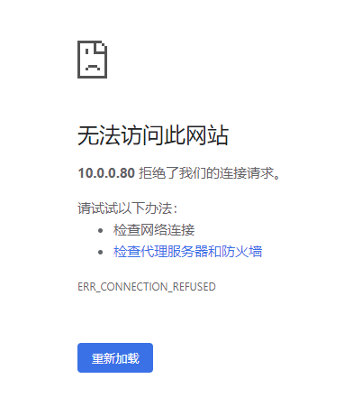

# 单节点部署 (嵌入式 ARM 版本) <!-- omit in toc -->

本教程用于嵌入式 ARM 版本的单节点部署、升级、过期 License 升级，并对常见问题做出解答，便于用户快速上手 DolphinDB 。包含以下主题：

- [1. 系统要求](#1-系统要求)
- [2. 部署 DolphinDB 单节点](#2-部署-dolphindb-单节点)
  - [第一步：下载](#第一步下载)
  - [第二步：更新软件授权许可](#第二步更新软件授权许可)
  - [第三步：启动单节点](#第三步启动单节点)
  - [第四步：Web 管理界面检查节点运行状态](#第四步web-管理界面检查节点运行状态)
- [3. 单节点升级](#3-单节点升级)
  - [第一步：正常关闭单节点](#第一步正常关闭单节点)
  - [第二步：备份旧版本的元数据文件](#第二步备份旧版本的元数据文件)
  - [第三步：升级](#第三步升级)
  - [第四步：重新启动单节点](#第四步重新启动单节点)
- [4. 授权许可文件过期更新](#4-授权许可文件过期更新)
  - [第一步：替换授权许可文件](#第一步替换授权许可文件)
  - [第二步：更新授权许可文件](#第二步更新授权许可文件)
- [5. 常见问题解答（FAQ）](#5-常见问题解答faq)
  - [5.1 端口被其它程序占用导致启动失败怎么办？](#51-端口被其它程序占用导致启动失败怎么办)
  - [5.2 Web 管理界面无法访问怎么办？](#52-web-管理界面无法访问怎么办)
  - [5.3 Linux 升级失败如何版本回退？](#53-linux-升级失败如何版本回退)
  - [5.4 在线更新授权文件失败怎么办？](#54-在线更新授权文件失败怎么办)
  - [5.5 如何进行配置参数调优？](#55-如何进行配置参数调优)
- [6. 参考](#6-参考)

## 1. 系统要求

| **系统要求项** | **具体指标** |
|---|---|
| 操作系统 | Linux（内核 3.10 及以上版本） |
| 内存 | 2GB 及以上 |
| Flash | 8GB 及以上 |
| 支持的 ARM CPU | - CORTEXA15<br>- CORTEXA9<br>- ARMV7<br>- ARMV8<br>- CORTEXA53<br>- CORTEXA57<br>- CORTEXA72<br>- CORTEXA73<br>- FALKOR<br>- THUNDERX<br>- THUNDERX2T99<br>- TSV110 |
| DolphinDB ARM 版使用的交叉编译器 32 位系统 | arm-linux-gnueabihf4.9 |
| DolphinDB ARM 版使用的交叉编译器 64 位系统 | aarch64-linux-gnu_4.9.3 |

若用户在实际板子上运行时出现问题，请反馈给我们（[support@dolphindb.com](support@dolphindb.com)）。

## 2. 部署 DolphinDB 单节点

### 第一步：下载

- 官方下载地址：[http://www.dolphindb.cn/downloads.html](http://www.dolphindb.cn/downloads.html)
- 通过 Shell 指令下载，以下载 2.00.9.1 版本为例：

```sh
wget "https://www.dolphindb.cn/downloads/DolphinDB_ARM64_V2.00.9.1.zip"
```

执行以下 Shell 指令解压安装包到指定目录，以解压 2.00.9.1 版本安装包到 */DolphinDB* 目录为例：

```sh
unzip DolphinDB_ARM64_V2.00.9.1.zip -d /DolphinDB
```

> :exclamation: 安装路径的目录名中不能含有空格字符或中文字符，否则启动数据节点时会失败。

### 第二步：更新软件授权许可

如果用户拿到企业版试用授权许可，只需用其替换如下文件即可。

```sh
/DolphinDB/server/dolphindb.lic
```

如果用户没有申请企业版试用授权许可，可以直接使用程序包中的社区版试用授权许可。社区试用版指定 DolphinDB 单节点最大可用内存为 8GB，有效期为20年。

### 第三步：启动单节点

进入 */DolphinDB/server* 目录，第一次启动时需要修改文件权限，执行以下 Shell 指令：

```sh
chmod +x dolphindb
```

由于嵌入式系统一般实际可使用内存较小，所以第一次启动时，建议根据实际环境修改与内存相关的配置参数。在 */DolphinDB/server* 目录执行以下 Shell 指令编辑单节点配置文件：

```sh
vim dolphindb.cfg
```

系统默认端口号是8848。如果需要指定其它端口可以通过参数 *localSite* 设置，例如修改端口为8900：

```sh
localSite=localhost:8900:local8900
```

使用参数 *maxMemSize* 限制 DolphinDB 进程可用的最大内存，以 GB 为单位。建议根据实际内存大小设置，例如修改为 0.8GB：

```sh
maxMemSize=0.8
```

使用参数 *regularArrayMemoryLimit* 设置数组的内存限制，以 MB 为单位。该参数必须是2的指数幂，默认值512。建议根据实际内存大小设置，例如修改为 64MB：

```sh
regularArrayMemoryLimit=64
```

参数 *maxLogSize* 是指当日志文件达到指定大小时，系统会将日志文件存档，以 MB 为单位。默认值是1024，最小值是100。建议根据实际内存大小设置，例如修改为 100MB：

```sh
maxLogSize=100
```

- 前台运行

执行以下 Shell 指令：

```sh
./dolphindb
```

- 后台运行

执行以下 Shell 指令：

```sh
sh startSingle.sh
```

可以执行以下 Shell 指令，查看节点是否成功启动：

```sh
ps aux|grep dolphindb
```

返回如下信息说明后台启动成功：


### 第四步：Web 管理界面检查节点运行状态

在浏览器中输入部署服务器 IP 地址和部署端口号（默认是 8848）即可进入 Web 管理界面，教程中的部署服务器 IP 地址为10.0.0.82，部署端口为8848，所以访问地址为10.0.0.82:8848，打开后的 Web 管理界面如下：


> :exclamation: 如果浏览器与 DolphinDB 不是部署在同一台服务器，需要关闭防火墙或者打开对应的部署端口，Web 管理界面才能正常打开。

## 3. 单节点升级

### 第一步：正常关闭单节点

进入 */DolphinDB/server/clusterDemo* 目录执行以下 Shell 指令：

```sh
./stopAllNode.sh
```

### 第二步：备份旧版本的元数据文件

单节点元数据的默认存储目录：

```sh
/DolphinDB/server/local8848/dfsMeta/
```

```sh
/DolphinDB/server/local8848/storage/CHUNK_METADATA/
```
可在 */DolphinDB/server* 目录执行以下 Shell 指令备份单节点元数据：

```
mkdir backup
cp -r local8848/dfsMeta/ backup/dfsMeta
cp -r local8848/storage/CHUNK_METADATA/ backup/CHUNK_METADATA
```

请注意：元数据文件可能通过配置文件指定存储在其它目录，如果在默认路径没有找到上述文件，可以通过查询配置文件中的 *dfsMetaDir* 参数和 *chunkMetaDir* 参数
确认元数据文件的存储目录。若配置中未指定 *dfsMetaDir* 参数和 *chunkMetaDir* 参数，但是配置了 *volumes* 参数，*CHUNK_METADATA* 目录在相应的 *volumes* 参数指定的目录下。

### 第三步：升级

下载所需升级版本的安装包，官方下载地址：[http://www.dolphindb.cn/downloads.html](http://www.dolphindb.cn/downloads.html)。

将新版本 *server* 目录下除 *dolphindb.cfg* 以及 *dolphindb.lic* 外的所有文件覆盖替换旧版文件。

### 第四步：重新启动单节点

进入 */DolphinDB/server* 目录执行以下 Shell 指令，后台运行 DolphinDB：

```sh
sh startSingle.sh
```

成功启动后，打开 Web 管理界面，在交互编程界面执行以下代码，查看 DolphinDB 当前版本：

```sh
version()
```

## 4. 授权许可文件过期更新

### 第一步：替换授权许可文件

用新的授权许可文件 *dolphindb.lic* 替换旧的授权许可文件，授权许可文件位置如下：

```sh
/DolphinDB/server/dolphindb.lic
```

### 第二步：更新授权许可文件

- 在线更新

打开 Web 管理界面，在交互编程界面执行以下代码完成更新：

```sh
updateLicense()
```

> 注意，在线更新有如下要求：
>  * License 授权的客户名称必须与原来的 License 相同。
>  * 授权的节点个数，内存大小，CPU 核数不能比原来的小。
>  * 更新只在执行该函数的节点生效。因此在集群环境下，需要在所有控制节点、代理节点和数据节点上运行该函数。
>  * License 的类型必须是 commercial（付费）类型和 free 类型。

- 离线更新

关闭 DolphinDB，然后重新启动，即可完成更新。

## 5. 常见问题解答（FAQ）

### 5.1 端口被其它程序占用导致启动失败怎么办？

DolphinDB 单节点默认启动端口是 8848，如果遇到无法启动 DolphinDB 的情况，建议打开 */DolphinDB/server* 目录下的 *dolphindb.log* 日志文件，若出现如下错误：

```
<ERROR> :Failed to bind the socket on port 8848 with error code 98
```

说明选用的端口被其他程序占用，导致 DolphinDB 无法正常启动，修改配置文件中的端口为其它空闲端口后即可正常启动。

### 5.2 Web 管理界面无法访问怎么办？

DolphinDB 正常启动后，在浏览器输入正确的访问地址，但是 Web 管理界面无法正常打开，如下图所示：



出现上述问题的原因基本上都是因为浏览器与 DolphinDB 不是部署在同一台服务器，且部署 DolphinDB 的服务器开启了防火墙。可以通过关闭部署了 DolphinDB 的服务器的防火墙或者打开对应的部署端口，解决这个问题。

### 5.3 Linux 升级失败如何版本回退？

如果升级以后，不能正常开启单节点 DolphinDB ，可按以下方式回退到旧版本。

**第一步：恢复旧版本元数据文件**

在 */DolphinDB/server* 目录执行以下 Shell 指令恢复已备份的单节点元数据：

```sh
cp -r backup/dfsMeta/ local8848/dfsMeta
cp -r backup/CHUNK_METADATA/ local8848/storage/CHUNK_METADATA
```

**第二步：恢复旧版本程序文件**

在官方下载旧版本程序包，把重新下载的旧版本 */DolphinDB/server* 目录下除 *dolphindb.cfg* 以及 *dolphindb.lic* 外的所有文件覆盖替换升级失败的文件。

### 5.4 在线更新授权文件失败怎么办？

在线更新授权文件需要满足[更新授权许可文件](#第二步更新授权许可文件)中在线更新的要求。如果不满足其中的要求，可以通过离线方式进行更新，或申请企业版 License。

### 5.5 如何进行配置参数调优？

可以参考 DolphinDB 官方参数配置说明进行配置参数调优：[参数配置](https://www.dolphindb.cn/cn/help/200/DatabaseandDistributedComputing/Configuration/index.html)。

如果遇到性能问题，请添加微信号13362150840（仅用于添加微信）或扫描下面二维码，客服会邀您进群，我们的工程师会解答您的问题。


## 6. 参考

更多详细信息，请参阅 DolphinDB 用户手册：

- [中文版 DolphinDB 用户手册](https://www.dolphindb.cn/cn/help/index.html)
- [英文版 DolphinDB 用户手册](https://www.dolphindb.com/help/index.html)

