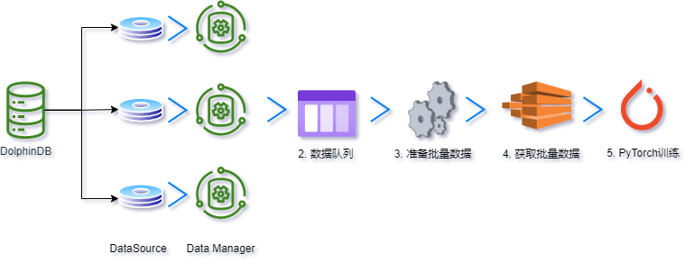
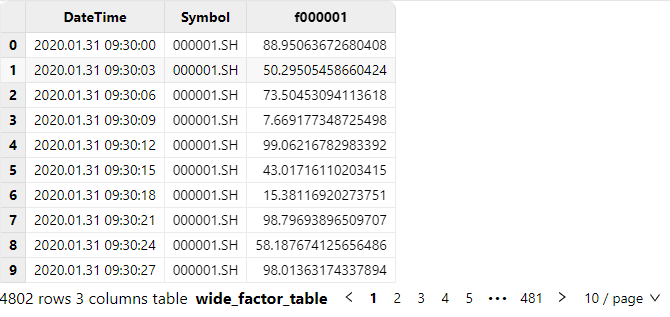

# 深度学习遇到 DolphinDB AI DataLoader
- [深度学习遇到 DolphinDB AI DataLoader](#深度学习遇到-dolphindb-ai-dataloader)
  - [总体架构](#总体架构)
  - [工作原理](#工作原理)
  - [AI DataLoader 详细介绍](#ai-dataloader-详细介绍)
    - [安装步骤](#安装步骤)
    - [DolphinDB类型与Tensor类型对照表](#dolphindb类型与tensor类型对照表)
    - [接口介绍](#接口介绍)
  - [简单使用示例](#简单使用示例)
  - [性能对比测试](#性能对比测试)
    - [环境准备](#环境准备)
    - [PyTorch DataLoader 性能测试](#pytorch-dataloader-性能测试)
    - [DDBDataLoader性能测试](#ddbdataloader性能测试)
    - [结论](#结论)
  - [总结](#总结)

深度学习模型有能力自动发现变量之间的关系，而这些关系通常是不可见的，这使得深度学习可以挖掘新的因子和规律，为量化投资策略提供更多可能性。在传统的量化策略开发流程中，通常会使用 Python 或第三方工具生成因子，并将其存储为文件。这些因子是构建深度学习模型的基础输入，包括技术指标、波动性指标和市场情绪指标等。随着证券交易规模不断扩大以及因子数据量的激增。传统的文件存储因子作为深度学习模型的输入，面临以下问题：

- 因子数据过大，内存带宽与存储空间瓶颈
- 因子数据与深度学习模型集成工程化与成本问题

为应对这些挑战，DolphinDB将数据库与深度学习相结合，开发了 DDBDataLoader。该工具用于因子数据的管理和深度学习模型的集成，旨在提高因子数据的效率和管理，并简化与深度学习模型的交互。着重于因子数据的管理和深度学习模型的集成，旨在提高因子数据的效率和管理，并简化了与深度学习模型的交互。

## 总体架构



**主要包括以下功能模块:**

- 因子数据存储模块
  - DolphinDB 存储历史因子数据
- 因子数据推送模块: 即 AI DataLoader 队列，其内部维护多个工作线程与消息队列，以提高并发性能，从 DolphinDB 中按照分区机制将因子数据转换为 PyTorch 等深度学习框架等可识别 tensor。策略研发人员可以实时从 DolphinDB 中获取所需的因子数据，并将其推送到深度学习模型中用于训练。这种实时性能帮助策略研发人员在需要时获取最新数据进行模型训练。
  - 第一步，构造 DDBDataLoader 对象，根据 groupCol 参数指定的数据列拆分为若干组查询，每组查询中，再根据 repartitionCol 参数指定的数据列拆分为若干个子查询，此种分割增加了数据的灵活性，使用户能够更精细地选择所需的数据，以满足深度学习模型的训练需求。
  - 第二步，DDBDataLoader 对象内部线程根据拆分的数据，会在后台线程中转换以及拼接成 Pytorch 训练所需的数据，再放入预准备队列中，即图中2，通过此种方式，可以减少客户端内存的占用。
  - 最后一步涉及从 DDBDataLoader 队列中迭代获取批量数据，并将这些数据返回给客户端，以供 PyTorch 训练使用，即图中5。

具体内部详细工作流程将在下一节《工作原理》中详细介绍。

## 工作原理

在构造时，`DDBDataLoader` 接收用户提供的 SQL 查询语句，并将其拆分为多个子查询组。`DDBDataLoader ` 使用后台线程从服务端获取数据，并将其处理为 PyTorch Tensor 格式的批量数据。

DDBDataLoader 提供了 *groupCol* 和 *groupScheme* 参数，用于将单个查询 SQL 分成多组查询。其中，每一个组定义了一个时间序列，例如一支股票的交易数据。若不指定，则认为所有的数据定义了一个时间序列。例如，一种典型的情况是表里的数据包含了全部的股票，而我们在训练模型的时候只希望每支股票仅利用自己的历史数据来对未来进行预测。在这种情况下，我们需要将 *groupCol* 设置为股票标的列，将 *groupScheme* 设置为所有的股票标的，也即每一个组是一支股票的交易数据。换言之，假如原始的查询 SQL 为：

```
select * from loadTable(dbName, tableName)
```

假设 *groupScheme* 为 `stockID`,  *groupScheme* 为 `["apple", "google", "amazon"]`，则原始的查询会被拆分成以下三组查询：

```
select * from loadTable(dbName, tableName) where stockID = "apple"
select * from loadTable(dbName, tableName) where stockID = "google"
select * from loadTable(dbName, tableName) where stockID = "amazon"
```

模型训练的时候，每组训练数据则只会来源于以上三组中的某一组，而不会出现跨组的情况。

另一方面，为了避免加载大量数据至内存中，`DDBDataLoader` 采用分区粒度管理数据。也就是说，每组查询每次只加载一个分区到内存中。通常来说， DolphinDB 的一个分区的大小在 100MB 到 1GB 之间，因此这种设计可以很好地限制内存的使用量。另一方面，基于这种分区粒度的管理方式，使得 `DDBDataLoader` 实现的 shuffle 和传统的 dataloader 实现的 shuffle 会有一些区别。具体地说，传统的 shuffle 是将数据进行完全随机地打乱，但这样会引入大量的随机 IO，会使得效率偏低。而 `DDBDataLoader` 使用的 shuffle 方式，则是先随机地选取一个数据的分区并读取，随后在这个分区内部进行 shuffle。使用这种方式，可以最大化地减少随机的 IO，以提升整个训练过程的效率。

另一组要说明的参数是 *repartitionCol*  和 *repartitionScheme* 。这组参数主要处理的是单个查询没办法直接拆成多个分区的情况。例如，一种常见的使用DolphinDB管理因子数据的方法是使用纵表来对因子数据进行管理（详见 [best_practices_for_multi_factor.md](https://gitee.com/dolphindb/Tutorials_CN/blob/master/best_practices_for_multi_factor.md)）。使用这种方法，则在获取可用的训练数据之前，需要先对所有的数据做一个 `pivot by` 将数据从纵表转化为宽表。然而，用户的数据量可能非常大，例如几百 G 甚至更多，在这种情况下，服务器的内存完全可能不够完成对所有数据的 `pivot by` 。针对这类情况，DDBDataLoader 提供了 *repartitionCol* 和*repartitionScheme*  参数这组参数，这组参数的作用是可以对全表的数据做进一步的切分，将全表数据按照 *repartitionCol* 和 *repartitionScheme*  拆成多个子表，然后对于每一个子表再做单独的 `pivot by`。换言之，假设原始的查询 SQL 为：

```
select val from loadTable(dbName, tableName) pivot by datetime, stockID, factorName
```

假设 *repartitionCol* 为 `date(datetime)`，*repartitionScheme* 为 `["2023.09.05", "2023.09.06", "2023.09.07"]`，则上述 的查询相当于会被拆成以下几个子查询：

```
select val from loadTable(dbName, tableName) pivot by datetime, stockID, factorName where date(datetime) = 2023.09.05
select val from loadTable(dbName, tableName) pivot by datetime, stockID, factorName where date(datetime) = 2023.09.06
select val from loadTable(dbName, tableName) pivot by datetime, stockID, factorName where date(datetime) = 2023.09.07
```

可以认为，设置了 *repartitionCol* 和 *repartitionScheme* 参数之后，相当于对上述的 `pivot by` 查询语句的结果又做了一个“重分区”，使得每个分区占用的空间不至于特别大。

下面介绍 `DDBDataLoader` 的各个组件。在 `DDBDataLoader` 内部，每组子查询由数据管理器 DataManager 管理，每个 DataManager 又对应一个 DataSource。这里的 DataSource，可视为一个分区的元数据。DataSource 通过传入的 Session 会话从 DolphinDB 服务端获取一个分区的数据，并将该分区的数据放入一个预载队列中。DataManager 则根据选取数据的顺序从 DataSource 产生的预载队列中获取预载的分区粒度数据，并将其根据滑动窗口大小和步长处理为相应的 PyTorch 的 Tensor 格式。`DDBDataLoader` 维护了一个包含多个数据管理器 DataManager 的数据池，数据池的大小由参数 `groupPoolSize` 控制。后台工作线程从这些数据管理器中提取批量数据，并将其组装成用于训练的数据格式和形状，然后放入整个 AI Dataloader 的预准备队列中。最后，迭代时，`DDBDataLoader` 从预准备队列中获取已准备好的批量数据，将其传递给客户端，供神经网络训练使用。

## AI DataLoader 详细介绍

### 安装步骤

DolphinDB Python API 自 1.30.22.2 版本起提供深度学习工具类 AI DDBDataLoader，提供对 DolphinDB SQL 对应的数据集进行批量拆分和重新洗牌的易用接口，将 DolphinDB 中的数据直接对接到 Pytorch 中。

```
pip install dolphindb_tools-0.1a1.whl //
```

期待输出：


### DolphinDB类型与Tensor类型对照表

| **DolphinDB 类型**             | **Tensor 类型** |
| :----------------------------- | :-------------- |
| BOOL \[不含空值]                | torch.bool      |
| CHAR \[不含空值]                | torch.int8      |
| SHORT \[不含空值]               | torch.int16     |
| INT \[不含空值]                 | torch.int32     |
| LONG \[不含空值]                | torch.int64     |
| FLOAT                          | torch.float32   |
| DOUBLE                         | torch.float64   |
| CHAR/SHORT/INT/LONG \[包含空值] | torch.float64   |

**注意**：

1. 若 sql 查询的结果表中包含不支持的类型，即便其列名被包含在 targetCol 中，即表示迭代中 y 对应的列名，详细见接口说明，该数据列也不会出现在输入数据和目标数据中。
2. 支持上述类型的 ArrayVector 类型。如果使用 ArrayVector 列，需要保证输入数据或目标数据全部为 ArrayVector 类型。
3. torch.bool 不支持布尔型数据的空值，因此获取 BOOL 类型数据前需确保不包含空值。


### 接口介绍

提供 DDBDataLoader 类来加载和访问数据，接口如下：

```
DDBDataLoader(
    ddbSession: Session,
    sql: str,
    targetCol: List[str],
    batchSize: int = 1,
    shuffle: bool = True,
    windowSize: Union[List[int], int, None] = None,
    windowStride: Union[List[int], int, None] = None,
    *,
    inputCol: Optional[List[str]] = None,
    excludeCol: Optional[List[str]] = None,
    repartitionCol: str = None,
    repartitionScheme: List[str] = None,
    groupCol: str = None,   
    groupScheme: List[str] = None,
    seed: Optional[int] = None,
    dropLast: bool = False,
    offset: int = None,
    device: str = "cpu",
    prefetchBatch: int = 1,
    prepartitionNum: int = 2,
    groupPoolSize: int = 3,
    **kwargs
)
```

#### 必选参数 (基础信息)

- ***ddbSession*(dolphindb.Session):** 用于获取数据的 Session 连接，包含训练所需的上下文信息。
- ***sql*(str):** 表示将数据取出用于训练的 SQL 语句，特别的，该语句必须为查询语句元代码，应尽可能简单，目前不支持 `group by`/`context by` 子句。

#### 参数(迭代列名类)

- ***targetCol*(List[str]):** 必填参数，字符串或者字符串列表。表示迭代中 y 对应的列名。
  - 如果指定了 *inputCol*，x 的数据为 *inputCol* 对应的列名， y 的数据为 *targetCol* 对应的列名，*excludeCol* 不生效。
  - 不指定 *inputCol*，指定 *excludeCol*：x 的数据为 所有列 - *excludeCol* 指定的列名，y 的数据为 *targetCol* 对应的列名
  - 不指定 *inputCol*，也不指定 *excludeCol*：x 的数据为所有列，y 的数据为 *targetCol* 对应的列名
- ***inputCol*(Optional[List[str]]):** 可选参数，字符串或者字符串列表。表示迭代中 x 对应的列名，如果不指定则表示所有列，默认值为 `None`。
- ***excludeCol*(Optional[List[str]]):** 可选参数，字符串或者字符串列表。表示迭代中 x 排除的列名，默认值为 `None`。

#### 可选参数(取数规则类)

- ***batchSize*(int):** 批次大小，指定每个批次数据中样本数量。表示每个批次只包含一个样本，默认值为 1。
- ***shuffle*(bool):** 是否对数据进行随机打乱，表示不对数据进行打乱，默认值为 False。
- ***seed*(Optional[int]):** 随机种子，该种子仅在 DDBDataLoader 对象中生效，与外界隔离。默认值为 None，表示不指定随机种子。
- ***dropLast*(bool):** 是否丢弃不足 *batchSize* 的数据，其值为 True 时，如果 *excludeColl* 无法整除查询结果的大小，则会丢弃最后一组不足 *excludeColl* 的数据。默认值为 False，表示不丢弃最后一组不足 *excludeColl* 的数据。

#### 可选参数(窗口类)

- ***windowSize*(Union[List[int], int, None]):** 用于指定滑动窗口的大小，默认值为 `None`。
  - 如果不指定该参数，表示不使用滑动窗口。
  - 如果传入一个整数值(int)，例如 *windowSize*=3，表示 x 的滑动窗口大小为 3，y 的滑动窗口大小为 1。
  - 如果传入两个整数值的列表，例如 *windowSize*=[4, 2]，表示 x 的滑动窗口大小为 4，y 的滑动窗口大小为 2。
- ***windowStride*(Union[List[int], int, None]):**  用于指定滑动窗口在数据上滑动的步长，默认值为 `None`。
  - 不指定 *windowSize* 时，该参数无效。
  - 如果传入一个整数值(int)，例如 *windowStride*=2，那么表示 x 的滑动窗口步长为 2，而 y 的滑动窗口步长为 1。
  - 如果传入两个整数值的列表，例如 *windowStride*=[3, 1]，那么表示 x 的滑动窗口步长为 3，而 y 的滑动窗口步长为 1。
- ***offset*(Optional[int]):**  y 相对于 x 偏移的行数（非负数）。不启用滑动窗口时，表示训练数据都在同一行中。指定滑动窗口时，该参数默认为 x 对应滑动窗口的大小，默认为 0。

#### 可选参数(数据切分类)

- ***repartitionCol*(Optional[str]):** 用于进一步拆分分组查询为子查询的列。默认值为 `None`。
- ***repartitionScheme*(Optional[List[str]]):** 分区点值，是一个字符串列表。每个列表元素将和 *repartitionCol* 指定的列一起使用，以通过条件 where repartitionCol = value 对数据做进一步筛选和分割，默认值为 `None`。
- ***groupCol*(Optional[str]):** 用于将查询划分成组的列。这个列的值将用于定义分组，默认值为 `None`。
- ***groupScheme*(Optional[List[str]]):** 分组点值，是一个字符串列表。每个列表元素将与 *groupCol* 指定的列一起使用，以通过条件 where groupCol = value 对数据进一步筛选和分组，默认值为 `None`。

> 注：
>
> 1. 其中 ***repartitionCol* 和 *repartitionScheme*** 功能可用于解决单个分区数据较多，无法直接进行全量运算的情况。通过将数据根据 *repartitionScheme* 的值进行筛选，可以将数据分割成多个子分区，每个子分区将按照 *repartitionScheme* 中的顺序排列。例如，如果 *repartitionCol* 为 date(TradeTime)， *repartitionScheme* 为 ["2020.01.01", "2020.01.02", "2020.01.03"]，则数据将被细分为三个分区，每个分区对应一个日期值。
> 2. 不同于 ***repartitionCol***/***repartitionScheme***，其中 ***groupCol* 和 *groupScheme*** 的分组之间不会出现跨分组的数据，例如，如果 *groupCol* 为 Code，*groupScheme* 为 [“\`000001.SH”, “\`000002.SH”, “`000003.SH”]，则数据将被划分为三个不相交的分组，每个分组对应一个股票代码。

#### 其他可选参数(不常用类)

- ***device*(Optional[str]):** 用于指定张量将被创建在哪个设备上。你可以将其设置为 “cuda“ 或其他支持的设备名称，以便在 GPU 上创建张量。默认值为 `"cpu"` ，表示在 CPU 上创建张量。
- ***prefetchBatch*(int):** 表示预加载的批数，用于控制一次性加载多少批次的数据，默认值为 `1`。
- ***prepartitionNum*(int):** 表示每个数据源预加载的分区数。工作线程将会在后台预加载分区到内存中。如果预载分区过多可能导致内存不足, 默认值为 `2`。
- ***groupPoolSize*(int):** 如果指定 *groupCol* 和 *groupScheme*，所有数据将被划分为若干个数据源，并在其中选择 *groupPoolSize* 个数据源准备数据。当有数据源中的数据被全部使用，新的数据源将被加入，直至所有数据源中的数据都被使用，默认值为 `3`。

## 简单使用示例

下面将提供一个简单供您快速体验 DDBDataLoader 使用，示例代码如下：

```
import dolphindb as ddb
from dolphindb_tools.dataloader import DDBDataLoader

sess = ddb.Session()
sess.connect("localhost", 8848, "admin", "123456")

sess.run("""
    t = table(1..10 as a, 2..11 as b, 3..12 as c)
""")

sql = 'select * from objByName("t")'
         
dataloader = DDBDataLoader(sess, sql, ["c"])

for X, y in dataloader:
    print(X, y)

--------------------------------------------------
tensor([[1, 2, 3]], dtype=torch.int32) tensor([[3]], dtype=torch.int32)
tensor([[2, 3, 4]], dtype=torch.int32) tensor([[4]], dtype=torch.int32)
tensor([[3, 4, 5]], dtype=torch.int32) tensor([[5]], dtype=torch.int32)
tensor([[4, 5, 6]], dtype=torch.int32) tensor([[6]], dtype=torch.int32)
tensor([[5, 6, 7]], dtype=torch.int32) tensor([[7]], dtype=torch.int32)
tensor([[6, 7, 8]], dtype=torch.int32) tensor([[8]], dtype=torch.int32)
tensor([[7, 8, 9]], dtype=torch.int32) tensor([[9]], dtype=torch.int32)
tensor([[ 8,  9, 10]], dtype=torch.int32) tensor([[10]], dtype=torch.int32)
tensor([[ 9, 10, 11]], dtype=torch.int32) tensor([[11]], dtype=torch.int32)
tensor([[10, 11, 12]], dtype=torch.int32) tensor([[12]], dtype=torch.int32)
```

在这个示例中，您使用一个内存表作为待加载的训练数据，并定义了 `targetCol=["c"]`。这表示将使用同一行的 "a", "b", "c" 三列作为训练的输入数据 X，并将 "c" 列作为训练的目标数据 y。

如果您指定了`offset=5`，那么每一份数据都将使用某一行的 "a", "b", "c" 作为训练输入数据 X，并且使用距离当前行5行之后的 "c" 列数据作为训练的目标数据 y。

```
dataloader = DDBDataLoader(sess, sql, ["c"], offset=5)

for X, y in dataloader:
    print(X, y)
```

输出如下：

```
tensor([[1, 2, 3]], dtype=torch.int32) tensor([[8]], dtype=torch.int32)
tensor([[2, 3, 4]], dtype=torch.int32) tensor([[9]], dtype=torch.int32)
tensor([[3, 4, 5]], dtype=torch.int32) tensor([[10]], dtype=torch.int32)
tensor([[4, 5, 6]], dtype=torch.int32) tensor([[11]], dtype=torch.int32)
tensor([[5, 6, 7]], dtype=torch.int32) tensor([[12]], dtype=torch.int32)
```

如果指定滑动窗口大小为 3，步长为 1，同时不输入 offset，则表示每份数据使用前三行的 “a“, “b“, “c“ 三列的数据和后一行的 “c“ 列数据，示例如下：

```
dataloader = DDBDataLoader(sess, sql, ["c"], windowSize=3, windowStride=1)

for X, y in dataloader:
    print(X, y)
```

输出如下：

```
tensor([[[1, 2, 3],
         [2, 3, 4],
         [3, 4, 5]]], dtype=torch.int32) tensor([[[6]]], dtype=torch.int32)
tensor([[[2, 3, 4],
         [3, 4, 5],
         [4, 5, 6]]], dtype=torch.int32) tensor([[[7]]], dtype=torch.int32)
tensor([[[3, 4, 5],
         [4, 5, 6],
         [5, 6, 7]]], dtype=torch.int32) tensor([[[8]]], dtype=torch.int32)
tensor([[[4, 5, 6],
         [5, 6, 7],
         [6, 7, 8]]], dtype=torch.int32) tensor([[[9]]], dtype=torch.int32)
......
```

## 性能对比测试

在深度学习中，数据加载和处理的效率对总体训练时长有重要影响。在本节性能测试中，重点关注了传统数据加载方式 (PyTorch DataLoader)  和 DolphinDB 集成 PyTorch (DDBDataLoader) 之间的耗时差异。

**测试场景**：为前 200 个时间点因子数据来预测下一个时间点 f000001 因子值。

**示例步骤**：

1. **创建因子数据集**：首先，您需要创建一个因子数据集，这是存储因子数据的地方。这个因子库将用于存储随机生成的数据。接下来，将生成随机数据，并将其写入因子数据集中。这些随机数据将模拟实际因子数据，供后续的训练使用。
2. **加载数据**：使用 SQL 查询从 DDBDataLoader中获取所需的因子数据或者 使用 PytorchDataLoader 加载二进制文件数据。
3. **提供给神经网络**：最后，获取的因子数据将被提供给神经网络进行训练。这些数据经过 DDBDataLoader或者 PytorchDataLoader 处理，已准备好供模型使用。

性能测试分为两个部分：

- **PyTorch DataLoader**：使用传统的数据加载方式进行训练数据。这可能包括将数据从文件读取并进行预处理。
- **DDBDataLoader**：使用 DDBDataLoader 准备训练数据。这种方式通过 DolphinDB 和 Session 直接将数据转换为 torch.Tensor，无需保存为文件。

在每种数据加载方式下，进行了 2000 次数据批次的迭代。通过比较两种数据加载方式的耗时差异，可以更清楚地了解 DDBDataLoader 性能优势。这种性能测试有助于评估 DDBDataLoader 在数据加载和处理方面的效率，为深度学习模型的训练提供参考和优化的方向。

**对比测试功能模块代码目录结构**


- datas：数据存储
- dist：[dolphindb_tools-0.1a1.whl](script/DolphinDB_AI_DataLoader_for_Deep_Learning/dist/dolphindb_tools-0.1a1.whl) 分发包
- prepare：数据集准备模块
  - [ddb_scripts.dos](script/DolphinDB_AI_DataLoader_for_Deep_Learning/prepare/ddb_scripts.dos)：DolphinDB 建库建表以及模拟写入脚本
  - [prepare_data.py](script/DolphinDB_AI_DataLoader_for_Deep_Learning/prepare/prepare_data.py)：PytorchDataLoader 测试准备数据
  - [prepare_index.py](script/DolphinDB_AI_DataLoader_for_Deep_Learning/prepare/prepare_index.py)：PytorchDataLoader 测试索引数据
- test：
  - [net.py](script/DolphinDB_AI_DataLoader_for_Deep_Learning/test/net.py)：定义神经网络
  - [test_wide_new.py](script/DolphinDB_AI_DataLoader_for_Deep_Learning/test/test_wide_new.py): DDBDataLoader 方式测试 
  - [test_wide_old.py](script/DolphinDB_AI_DataLoader_for_Deep_Learning/test/test_wide_old.py): 传统 PytorchDataLoader 方式测试

### 环境准备

**服务端**

- **硬件环境**

| **硬件名称** | **配置信息**              |
| :----------- | :------------------------ |
| 主机名       | HostName                  |
| 外网 IP      | xxx.xxx.xxx.218           |
| 操作系统     | Linux（内核版本3.10以上） |
| 内存         | 500 GB                    |
| CPU          | x86_64（64核心）          |
| GPU          | A100                      |
| 网络         | 万兆以太网                |

- **软件环境**

| **软件名称**          | **版本信息**               |
| :-------------------- | :------------------------- |
| DolphinDB             | 2.00.10.1                  |
| ddbtools              | 0.1a1                      |
| python                | 3.8.17                     |
| dolphindb             | 1.30.22.2                  |
| numpy，torch ，pandas | 1.24.4, 2.0.0+cu118, 1.5.2 |

- **性能测试工具**

使用 `Python ` 中的第三方库 ` line_profiler （4.0.3）`，将待测试代码封装为函数后添加 `@profile` 装饰器，在终端执行 `kernprof -l -v test.py` 进行性能测试。

- **测试数据**

快照 3 秒频因子数据，生成总数据约为 277G，测试数据生成脚本如下：

在 DolphinDB 客户端执行，指定 `Datetime ` 和 `Symbol ` 为分区列和排序列，在数据库 `dfs://test_ai_dataloader` 中创建分区表 `wide_factor_table`。表中包含 `Datetime ` 时间列和 `Symbol ` 股票名称列，以及 1000 列因子列（名称从 f000001 到 f001000）。类型分别为 `DATETIME ` 和 `SYMBOL`，因子列类型全部使用 `DOUBLE`。详细代码见工程代码中 *[ddb_scripts.dos](script/DolphinDB_AI_DataLoader_for_Deep_Learning/prepare/ddb_scripts.dos)*，核心代码如下：

```
dbName = "dfs://test_ai_dataloader"
tbName = "wide_factor_table"

if (existsDatabase(dbName)) {
    dropDatabase(dbName)
}

// 股票数量
numSymbols = 250
// 因子数量
numFactors = 1000

dateBegin = 2020.01.01
dateEnd = 2020.01.31
symbolList = symbol(lpad(string(1..numSymbols), 6, "0") + ".SH")
factorList = lpad(string(1..numFactors), 7,"f000000")

colNames = ["Datetime", "Symbol"] join factorList
colTypes = [DATETIME, SYMBOL] join take(DOUBLE, numFactors)
schema = table(1:0, colNames, colTypes)
```

写入完成后，使用下面的脚本打印 SQL 查询结果，确认已经写入成功。

```
select DateTime, Symbol, f000001 from loadTable("dfs://test_ai_dataloader", "wide_factor_table") where Symbol=`000001.SH, date(DateTime)=2020.01.31
```

示例数据如下：



### PyTorch DataLoader 性能测试

在传统深度学习中，通常会采取以下步骤来处理训练数据：

- 生成二进制数据文件
- 生成索引信息 pkl 文件
- 使用 PyTorch DataLoader 方式加载数据到模型中

首先使用 numpy 库生成二进制数据文件，此阶段耗时约为 **83分钟**，详细见 *[prepare_data.py](script/DolphinDB_AI_DataLoader_for_Deep_Learning/prepare/prepare_data.py)* ，核心代码如下:

```
st = time.time()
for symbol in symbols:
    for t in times:
        sql_tmp = sql + f""" where Symbol={symbol}, date(DateTime)={t}"""
        data = s.run(sql_tmp, pickleTableToList=True)
        data = np.array(data[2:])
        data.tofile(f"datas/{symbol[1:]}-{t}.bin")
        print(f"[{symbol}-{t}] LOAD OVER {data.shape}")
ed = time.time()
print("total time: ", ed-st)   # 耗时约 4950s
```

在数据处理过程中，通常需要计算滑动窗口的大小和步长。这两个参数决定了如何从数据中切割出训练样本。滑动窗口的大小定义了每个训练样本的时间窗口长度，而步长定义了滑动窗口之间的间隔, 一旦确定了滑动窗口的大小和步长，接下来会计算每份数据需要从哪些文件中获取数据。这个计算过程通常涉及到迭代数据并根据滑动窗口的设置来确定数据的切割方式。然后，将这些索引信息保存在 *index.pkl*, 以供后续使用，此阶段耗时约为 4分钟。核心代码如下，详细见 *[prepare_index.py](script/DolphinDB_AI_DataLoader_for_Deep_Learning/prepare/prepare_index.py)* :

```
with open("index.pkl", 'wb') as f:
    pickle.dump(index_list, f)
ed = time.time()
print("total time: ", ed-st)    # 约 234s
```

最后在 Python 代码中，定义一个数据集（DataSet），用于管理和加载训练数据，将 *index.pkl* 内容读取至内存，使用 mmap 方式打开数据文件，使得能够通过下标访问快速将数据从文件中读取到内存，此阶段耗时约为 4 分钟，核心代码如下，详细见 *[test_wide_old.py](script/DolphinDB_AI_DataLoader_for_Deep_Learning/test/test_wide_old.py)*：

```
def main():
    torch.set_default_device("cuda")
    torch.set_default_tensor_type(torch.DoubleTensor)

    model = SimpleNet()
    model = model.to("cuda")

    loss_fn = nn.MSELoss()
    loss_fn = loss_fn.to("cuda")
    optimizer = torch.optim.Adam(model.parameters(), lr=0.05)
    dataset = MyDataset(4802)
    dataloader = DataLoader(
        dataset, batch_size=64, shuffle=False, num_workers=3,
        pin_memory=True, pin_memory_device="cuda",
        prefetch_factor=5,
    )

    epoch = 10
    for _ in range(epoch):
        for x, y in tqdm(dataloader, mininterval=1):
            x = x.to("cuda")
            y = y.to("cuda")
            y_pred = model(x)
            loss = loss_fn(y_pred, y)
            optimizer.zero_grad()
            loss.backward()
            optimizer.step()
            
if __name__ == "__main__":
    main()
```

至此，基于 PytorchDataLoader 深度学习训练数据流程全部结束，第一阶段生成二进制文件大约为 83 分钟，第二阶段生成索引数据信息为 4分钟，第三阶段迭代训练 2 万次耗时为 25 分钟，总耗时为 112 分钟。

### DDBDataLoader性能测试

在 DDBDataLoader 中，通常会采取以下步骤来处理训练数据：

- 从 DolphinDB 分布式表中加载数据
- 将加载数据处理成训练所需格式

本次测试中，使用了 DDBDataLoader 来获取训练数据。与传统方法不同，无需将数据保存为文件并在客户端进行处理。相反，通过 Session 将 SQL 查询结果直接转换为 torch.Tensor，这可以减少数据传输和存储成本，在测试代码中，使用 Python 中的第三方库 line_profiler 统计各个部分的执行时间，例如数据加载、模型训练等。测试步骤如下：

1. **定义 DDBDataLoader**

在 Python 客户端执行以下代码，使用已建立的数据库表执行 SQL 查询后的结果作为数据集。该数据集指定了目标列为 ["f000001"]，并排除了 `Symbol ` 列和 `DateTime ` 列的数据。此外，还配置了以下参数：

- `batchSize=64` 表示 一批数据大小为 64。
- `windowSize=[200, 1], windowStride=[1, 1], offset=200 ` 分别表示输入数据和目标数据的滑动窗口大小分别为 200 和 1，滑动窗口步长分别为1和1，offset为200。
- `shuffle=True` 表示数据打乱设置为 True，使用随机种子 `seed=0`。
- 使用每支股票的时序数据进行训练，指定 ` groupCol="Symbol"` 和 `groupScheme=symbols`，其中 `symbols` 是包含所有股票名称的字符串列表。
- 为了降低数据分块粒度，指定 `repartitionCol="date(DateTime)"` 和 ` repartitionScheme=times`，其中 times 是包含 2020.01.01到2020.01.31 所有日期的列表。
- 训练将在 GPU上进行，指定 `device="cuda"`，将 `torch.Tensor` 创建到 GPU 上。
- `prefetchBatch=5, prepartitionNum=3` 表示预准备 5 批数据，配置每组查询预载3个子查询的结果。

这些配置将有助于提高训练效果并充分利用 GPU 和后台线程资源。

```
import dolphindb as ddb
from dolphindb_tools.dataloader import DDBDataLoader

sess = ddb.Session()
sess.connect('localhost', 8848, "admin", "123456")

dbPath = "dfs://test_ai_dataloader"
tbName = "wide_factor_table"

symbols = ["`" + f"{i}.SH".zfill(9) for i in range(1, 251)]
times = ["2020.01." + f"{i+1}".zfill(2) for i in range(31)]

sql = f"""select * from loadTable("{dbPath}", "{tbName}")"""

dataloader = DDBDataLoader(
    s, sql, targetCol=["f000001"], batchSize=64, shuffle=True,
    windowSize=[200, 1], windowStride=[1, 1],
    repartitionCol="date(DateTime)", repartitionScheme=times,
    groupCol="Symbol", groupScheme=symbols,
    seed=0,
    offset=200, excludeCol=["DateTime", "Symbol"], device="cuda",
    prefetchBatch=5, prepartitionNum=3
)
```

 

2. **定义网络并训练**

下述代码在 Python 客户端执行，它定义了一个简单的 CNN 神经网络结构，并定义了损失函数和优化器。最后像使用 torch 中 DataLoader 一样，迭代 DDBDataLoader 获取数据，输入到网络中进行训练，核心代码如下，详细见 *[test_wide_new.py](script/DolphinDB_AI_DataLoader_for_Deep_Learning/test/test_wide_new.py)*：

```

model = SimpleNet()
model = model.to("cuda")
loss_fn = nn.MSELoss()
loss_fn = loss_fn.to("cuda")
optimizer = torch.optim.Adam(model.parameters(), lr=0.05)
num_epochs = 10

model.train()
for epoch in range(num_epochs):
    for X, y in dataloader:
        X = X.to("cuda")
        y = y.to("cuda")
        y_pred = model(X)
        loss = loss_fn(y_pred, y)
        optimizer.zero_grad()
        loss.backward()
        optimizer.step()
```

通过将数据直接转换为 `torch.Tensor` 并使用 DDBDataLoader 管理数据，可以更高效地获取和使用训练数据，从而提高深度学习模型的训练效率。这种方法减少了数据传输和存储的开销，并使训练过程更加灵活和高效。此种方式总耗时为 25 分钟。


### 结论

从比对结果可以看到，本次测试中，对比了传统方式（PyTorch DataLoader）和 DDBDataLoader，DDBDataLoader 一体化集成 PyTorch 耗时约为 25分钟，内存占用约为 0.8 GB，代码行数约为 70 行， PyTorch DataLoader 总耗时 112 分钟，内存占用约为 4GB，代码行数约为 200 多行。考虑两种方式的特点，原因大概如下：

- **性能提升**：在数据准备以及迭代取数耗时方面，DDBDataLoader 耗时明显低于传统方式。这主要是因为 DDBDataLoader 可以直接从 DolphinDB 中直接获得数据，将每个分区（数据源）的数据整体打乱后提供给客户端进行处理。传统方式通常将数据集和 DataLoader 处理逻辑分开，需要先将数据导出成磁盘上的文件，然后再提供给客户端使用，这会对性能产生较大影响。所以，DDBDataLoader 最终相比传统方法有显著性能提升。
- **灵活性增加**：在灵活性上，DDBDataLoader 使用 SQL 的方式来初始化，这提供了很高的灵活性。例如，用户可以直接用 SQL 实现新的因子，新实现的因子可以直接应用到 PyTorch 的训练中，而不需要再像传统的方式那样需要将数据再导出成磁盘上的文件。
- **内存占用减少**：在内存方面，DolphinDB 内部并行线程以及多消息队列机制，迭代数据集，使用完内存，及时回收，返还给操作系统，减少内存在进程中常驻时间，而传统的数据集和 DataLoader 方式，为直接加载全量数据到内存中，导致内存长时间占用，当涉及数据集过大时，容易产生 OOM 现象。这样 DDBDataLoader 内存使用减少为原来的 1/5。
- **代码行数减少**：在代码简洁性方面，DolphinDB 封装了一个 DataLoader 接口，用户使用无感知，只需调用接口，将数据传输到 PyTorch 中，仅仅只需代码 70 行，而 传统的数据集和 DataLoader 需要重新构造一个接口用于数据集与 PyTorch 的对接，代码需 200 多行行。极大的减低了开发运维成本。

综上，DDBDataLoader 可以提升性能以及大幅降低 DolphinDB 内数据用于 PyTorch 训练的开发运维成本。

## 总结

DDBDataLoader 是 DolphinDB 在深度学习和数据库结合方面的一次探索。它旨在解决以下问题:

- 充分利用了 DolphinDB 的特性，将 SQL 查询拆分为多个查询，从而减少了数据在客户端的内存占用
- DDBDataLoader 采用即时查询的方式直接从数据库获取数据，可以灵活得操作数据、提高效率且降低开发运维成本。

综上所述，将 DolphinDB 和 DDBDataLoader 集成到因子数据管理流程中，有助于更好地满足量化投资策略的需求，充分发挥深度学习模型的潜力。这种集成方式能够提高效率，降低成本，并提供更强大的因子数据管理和应用能力。

