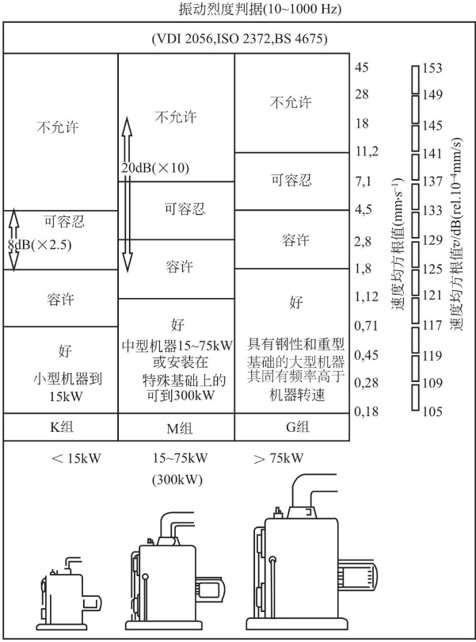
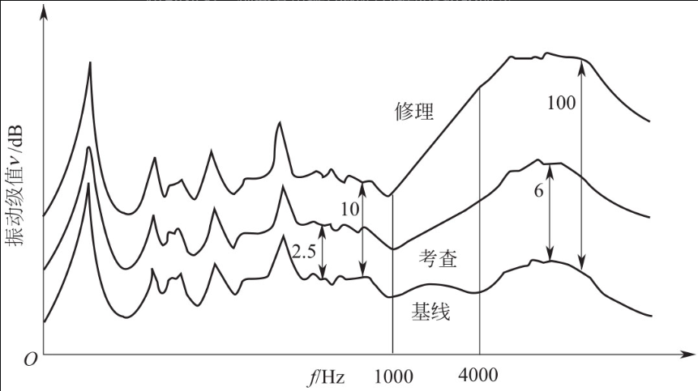
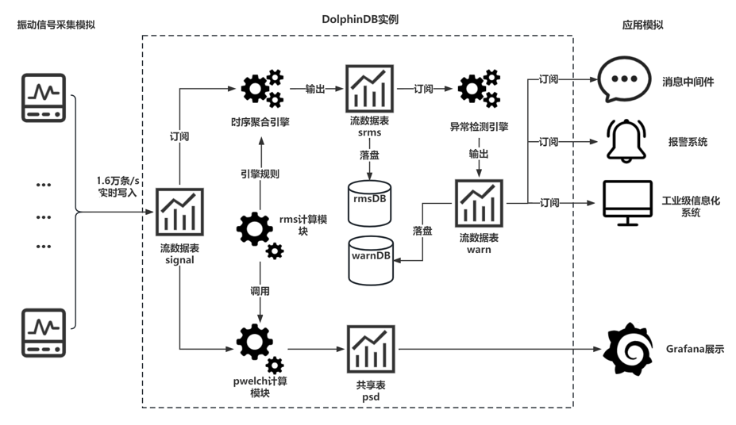
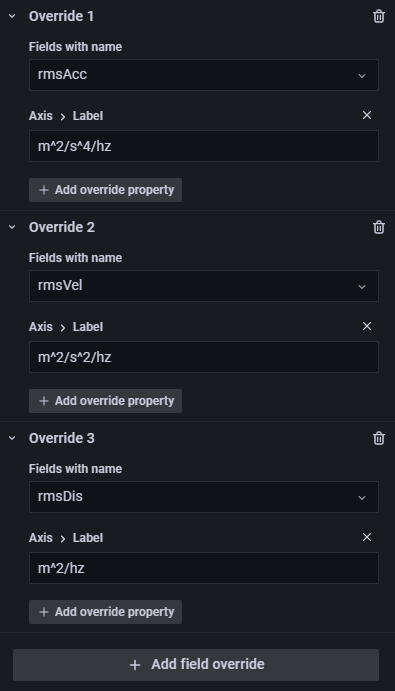
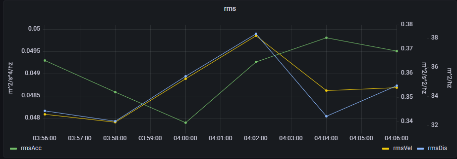
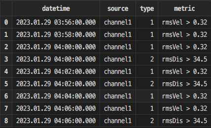

# 随机振动信号分析解决方案

- [随机振动信号分析解决方案](#随机振动信号分析解决方案)
  - [1. 应用场景](#1-应用场景)
    - [1.1 行业背景](#11-行业背景)
    - [1.2 真实场景](#12-真实场景)
      - [1.2.1 设备状态评定标准的选择及预警、报警限的设定](#121-设备状态评定标准的选择及预警报警限的设定)
      - [1.2.2 设备状态发展趋势](#122-设备状态发展趋势)
      - [1.2.3 振动级值预测](#123-振动级值预测)
    - [1.3 DolphinDB优势](#13-dolphindb优势)
      - [1.3.1 流数据引擎](#131-流数据引擎)
      - [1.3.2 经典SCADA与信息化的融合](#132-经典scada与信息化的融合)
      - [1.3.3 计算引擎](#133-计算引擎)
      - [1.3.4 轻量级部署](#134-轻量级部署)
  - [2. 概念介绍](#2-概念介绍)
    - [2.1 能量与功率](#21-能量与功率)
    - [2.2 能量谱密度和功率谱密度](#22-能量谱密度和功率谱密度)
      - [2.2.1 能量谱](#221-能量谱)
      - [2.2.2 功率谱](#222-功率谱)
    - [2.3 功率谱密度的估计方法](#23-功率谱密度的估计方法)
      - [2.3.1 周期图法](#231-周期图法)
      - [2.3.2 窗函数优化周期图法](#232-窗函数优化周期图法)
  - [3. 解决方案](#3-解决方案)
    - [3.1 场景描述](#31-场景描述)
    - [3.2 架构图及说明](#32-架构图及说明)
  - [4. 实现步骤](#4-实现步骤)
    - [4.1 实时数据模拟](#41-实时数据模拟)
    - [4.2 功率谱密度计算函数（pwelch）实现](#42-功率谱密度计算函数pwelch实现)
    - [4.3 均方根计算函数（rms）实现](#43-均方根计算函数rms实现)
    - [4.4 流数据发布-订阅-消费](#44-流数据发布-订阅-消费)
      - [4.4.1 流表的定义](#441-流表的定义)
      - [4.4.2 流数据消费-引擎定义](#442-流数据消费-引擎定义)
      - [4.4.3 数据的订阅](#443-数据的订阅)
    - [4.5 Grafana 连接展示](#45-grafana-连接展示)
      - [4.5.1 查看功率谱密度](#451-查看功率谱密度)
      - [4.5.2 查看功率谱密度均方根](#452-查看功率谱密度均方根)
    - [4.6 报警分析](#46-报警分析)
  - [总结](#总结)
    - [注释](#注释)
    - [参考文献](#参考文献)


## 1. 应用场景

随机振动[注1]会发生在工业物联网的各个场景中，包括产线机组设备的运行、运输设备的移动、试验仪器的运行等等。通过分析采集到的振动信号可以预估设备的疲劳年限、及时知晓设备已发生的异常以及预测未来仪器可能发生的异常等等。本篇教程会提供给有该方面需求的客户一个完整的解决方案，帮助用户使用DolphinDB 对振动信号进行分析。

### 1.1 行业背景

随着智能制造的逐渐普及，新型设备相比传统设备更精密，设备成本急剧升高的同时人工维护的成本也在不断提高。故当下自动化监测的方式越来越被业界接受，一来可以降低人力成本，二来可以更加科学系统地对待生产出现的各种状况。

目前业界信号分析的方法有四种，包括时域分析、频域分析、时频联合域分析以及功率谱分析。针对不同的信号使用不同的方法。实际工程上的信号通常都是随机信号。针对随机信号，由于不可能对所有点进行考察，也就不可能获得其精确的功率谱密度，故只能利用谱估计的方法来“估计”功率谱密度。

### 1.2 真实场景

工业物联网场景中，可把设备故障分为突发性故障（随机故障）与时间依存性故障。随机故障由偶然因素引起，以往很难防止这类故障的发生，但是在传感器和微处理器迅速发展的今天，可通过设备状态在线实时监测做到避免随机故障。而时间依存性故障则可以在分析建模的基础上，预测故障发展趋势及机组维修时间。要进行上述的监测和预测，免不了要对设备进行状态分析。设备状态分析的方法，大致可分为振动时域分析和振动频域分析。

- 振动时域分析法，主要使用在时域空间内的一些特征量来判断设备状态，包括峰值、平均峰值、均方根值等等。
- 振动频谱分析法，提示振动过程的频率结构是进行设备状态分析的重要途径，特别是随着傅里叶变换、经典谱分析、现代谱分析的出现和频谱分析仪的推出，频域分析得到了广泛采用。

以工业机组为例，真实场景应在确定评定标准、设定报警限的基础上，根据机组设备的状态发展趋势，对健康状态进行监测以及预测振动极值，以实现机组设备的全生命周期健康管理。

#### 1.2.1 设备状态评定标准的选择及预警、报警限的设定

振动烈度的大小反映了机组整体振动程度，要正确判断机组的工作状况，就必须合理地选定烈度标准。场景中具体的标准选定如下：



振动烈度判据的标准①

通常先根据机器的功率来查表，场景中每个机组的功率大概在2250kw，所以可以得到轴承处的振动烈度界限：4.5mm/s~11.2mm/s。另外还可将振动信号进行时频转换，实践表明，可以将频谱分析中获得的各个频率分量的振动级值变化作为评价的对象。这里的振动级值是振动速度级值，在其他场景中也可以是加速度级值和功率级值。如下图：



频率分量振动级值判据①

针对振动烈度范围，可以对机组状态振动烈度预警限以及振动烈度报警限进行选取。本场景采用振动烈度界限为限值指标，即预警限制设定为4.5mm/s；报警限值设定为11.2mm/s。针对振动级值变化判据，同样可以得出振动级值报警限与预警限。有了这些，就可对机组进行检测管理。

#### 1.2.2 设备状态发展趋势

设备的状态发展趋势大概可由以下四部分组成：

- 安装
- 作用累计期
- 损伤累计期
- 故障

在机组运行的作用累积期与损伤累积期中，时间依存性故障的发展使振动级值蕴含惯性上升规律；而实际工作状态的变化与人为因素又使机组的运行受到不可预料的随机性影响，产生随机性振动。因此机组振动级值的发展是由确定性趋势因素加随机性因素构成的，在振动级值发展趋势图上体现为上升中的波动状。

振动是循环力通过机械正常传递的副产品，对于大型旋转机组，最初的振动是因制造缺陷产生的。经过了磨合期，当机组磨损、基础下沉、部件变形后，其机械动态特性开始出现错综复杂的变化，如轴变得不同心、部件磨损量增加、转子变得不平衡、间隙增加等，这些因素都可以振动级值增加反映出来，并且振动级值的发展趋势是渐增的。

由以上描述可知，选用振动级值作为趋势分析中反映机组状态的敏感因子，通过对振动级值的在线分析可揭示机组状态的发展趋势。

#### 1.2.3 振动级值预测

在大型旋转机组趋势预测中所采用的基本方法是：以机组的机械动态特性为主要研究对象，通过传感器实时检测反映机组机械动态特性参数（振动级值，包括振动烈度与振动分量级值），并在线对机械动态特性进行历史、现状以及随后发展的对比和分析，找出机械系统机械动态特性发展的“级值-时间”趋势，揭示机组整体以及机组主要部件运行状态的发展模式，预测振动级值和故障发生日期，实现对机组工作状态趋势的预测。

振动级值趋势预测可以通过如图所示的“级值-时间趋势图”来描述：


级值-时间趋势图①

根据振动级值的变化，一个或多个频率分量在若干个周期测量后的级值增加，找出故障发展的“级值-时间”推测趋势。选择合适的曲线拟合方法，将结果曲线外推，从而揭示什么时间状态将达到危险的极限，这样可以安排适当的日期来对机组进行维护。而曲线拟合的方法有很多种，包括时序模型预测、灰色预测、人工智能预测、遗传算法预测等等。

### 1.3 DolphinDB优势

DolphinDB 是由浙江智臾科技有限公司研发的一款高性能分布式时序数据库，集成了功能强大的编程语言和高容量高速度的流数据分析系统，为海量结构化数据的快速存储、检索、分析及计算提供一站式解决方案，适用于工业物联网领域。其主要优点包括：

#### 1.3.1 流数据引擎

DolphinDB 的流式计算框架具备高性能实时流数据[注2]处理能力，支持毫秒甚至微秒级别数据计算，非常适合用于随机振动信号的处理和分析。

#### 1.3.2 经典SCADA与信息化的融合

DolphinDB 能实现传统 SCADA 的功能。并在此基础上融合企业已有的 DCS、MES、ERP 等工业级信息化系统。支持Kafka等消息中间件、MySQL等关系数据库、Grafana 等商业BI 组件。

内置脚本编程语言，用户可以使用 SQL 语句进行数据处理和查询，也可以通过类 Python 语法的脚本语言实现复杂功能。支持通过自定义算法开发分析模型，支持调用机器学习模型实现预测。

#### 1.3.3 计算引擎

DolphinDB 内置1400+函数，具备强大的分布式聚合计算能力。可以实现函数化编程、时间序列运算、矩阵运算、统计分析、机器学习、字符串处理、文件处理等功能。

提供的 signal 插件可用于专业领域的信号分析与处理，在数据库内实现傅里叶变换、小波变换、功率谱密度估计等复杂功能。

#### 1.3.4 轻量级部署

DolphinDB 使用 C++开发，兼容性好，支持Winodws、Linux、麒麟鲲鹏等操作系统，适配 X86、ARM、MIPS（龙芯）等。单机部署时安装文件仅70M大小，方便搭建高可用、可扩展集群。并且支持 Docker 和 K8S 一键部署，支持端边云架构，支持云边一体的数据实时同步。可作为 IaaS 底层支撑。

## 2. 概念介绍

### 2.1 能量与功率

能量和功率常常用于描述一个物体运动的程度。从宏观的角度看，能量与功率成正相关。从微观的角度看，能量是功率在一定时间范围内的定积分。假设功率是P(t)（这里的功率是瞬时功率，所以是关于时间t的函数），那么某种能量就可以用下式表达：

  

再把表达式的时间变化区间改为更为一般的形式，即可得到一般信号的能量及功率表示，如下式：

  

有了能量的表达式，我们就可以得出平均功率的表达式：

  

有了上述基础，我们将能量和平均功率的表达式中的瞬时功率函数用具体的函数代入即可得到各种种信号的能量、平均功率的表达式。

在实际的通信系统中，信号都具有有限的发射功率、有限的持续时间，因而具有有限的能量E，因而可称为能量信号。但是，若信号的持续时间非常长，例如广播信号，则可以近似认为它具有无限长的持续时间。此时，认为定义的信号平均功率是一个有限的正值，但是其能量近似等于无穷大。我们把这种信号称为功率信号。根据以上信息判断，能量信号的能量表达式是有极限的，P也是有极限的，但是功率信号的能量表达式极限不存在。

接下来介绍信号的分类：

- 周期信号：持续时间有限为能量信号，持续时间无限则为功率信号
- 非周期信号
  - 持续时间有限，时间趋向边界时瞬时功率函数值趋向0，此种信号为能量信号
  - 持续时间无限，但幅度有限的信号，可称为功率信号
  - 持续时间无限，幅度也无限，则既不是功率信号也不是能量信号

### 2.2 能量谱密度和功率谱密度

#### 2.2.1 能量谱

如果信号是能量信号，通过傅里叶变换，就很容易分离不同频域分量所对应的能量，频率 对应的能量为，对  积分就能得到信号的总能量，由此，就定义为能量谱密度(有时把转换为也可以，此时能量谱密度为)。

根据著名的巴塞法尔定律，能量在时域和频域是守恒的，故可以得出下面的式子：

  
其中 就是能量谱密度。

#### 2.2.2 功率谱

由于功率信号具有无穷大的能量，所以按照能量E的公式，这个积分是不存在的。但是我们可以把这个信号截断成小块。例如，把信号  截断成一个截短信号, $-T/2<t<T/2$ 。这样就是一个能量信号了，此时根据上一小节能量谱的推算过程，利用傅里叶变换可以求出其能量谱密度。

接下来得出信号的能量和平均功率表达式，其中 ：

  

当T在增加的时候，能量也是在增加的。假设极限 存在，定义它为的功率谱密度函数，记作 的功率谱为：

  

### 2.3 功率谱密度的估计方法

上述内容均为理论推导，当我们遇到随机振动信号时，大多数情况仍然只能估计PSD谱，估计的方法有很多，接下来简单介绍功率密度谱的几种估计方法。

功率密度谱估计的主要方法有经典谱估计以及现代谱估计，经典谱估计是将采集数据外的未知数据假设为零；现代谱估计是通过观测数据估计参数模型再按照求参数模型输出功率的方法估计功率谱，应用最广的是AR参数模型。本篇文章使用经典谱估计进行振动信号的分析。

经典功率谱估计的方法有两种：周期图法和自相关法。本小节主要介绍周期图法以及加窗后的周期图法。


功率谱密度估计方法

#### 2.3.1 周期图法

周期图法又名为直接法。该方法是把随机信号  的 N点观察数据 视为 一能量有限信号，直接取    的傅里叶变换，得，然后再取其幅值的平方，并除以 $N$ ，作为对真实的功率谱  的估计：

  

由此可见在 $n → ∞$ 时，既不存在均值，也不存在极限，它只能看作是对真实谱做均值运算时的一个样本。缺少了统计平均，在记录的信号序列长度一定的条件下，要保证足够高的谱分辨率，谱估计的方差会很大，谱的正确性会很差。因此周期图的方差性能不好。需要对周期图法进行一些改进，有平均以及平滑两种方式，本节主要介绍平滑，也就是用适当的窗函数对谱进行平滑。

#### 2.3.2 窗函数优化周期图法

窗函数优化的思想是把一长度为 $N$ 的数据 分成 L 段，每段的长度为M，分别求每一段的功率谱，然后加以平均，以达到所希望的目的。首先对分段的数据施加矩形窗，则第 $i$ 段的数据变为：

  

由此得到修正后的周期图，即平均周期图：

  

这种方法又称平均周期图法（Bartlett法），本文后续提到的 welch 方法是对平均周期图法的改进。主要改进在两个方面：一是在对 分段时，允许每段数据存在部分的交叠；二是每一段的数据窗口可以不是矩形窗口。这样可以改善由于矩形窗所造成的分辨率较差的影响。 然后按照 Bartlett 法求每一段的功率谱，并对结果进行归一化，从而得到进一步修正的周期图，即：

  

其中U为归一化因子， 是数据窗口。

因为 Welch 算法各段允许交叠，从而增大了段数 $L$，这样可以更好地改善方差特性。但是数据的交叠又减小了每一段的不相关性，使方差的减小不会达到理论计算的程度。另外，选择合适的窗函数可以减小频谱的泄漏，改善分辨率。

## 3. 解决方案

本篇文章将以一个典型的工业物联网场景为案例，通过 DolphinDB 实现随机振动信号分析解决方案。

### 3.1 场景描述

假定有16台振动传感器，每台设备每毫秒采集一条监测记录，包含时间戳、设备号和指标三个字段，每秒共写入1.6万条数据，并采用单值模型[注3]存储。有以下需求：

- 实时计算：每2分钟对过去2分钟的功率谱密度进行计算。
- 报警分析：对写入数据库的实时数据进行报警分析，如果有满足报警规则的数据则把相应的设备信息和实时数据以及触发报警规则写入到报警表中。
- 聚合查询：查询每台振动传感器过去任意时间段的谱密度。

数据结果展示在 Grafana 中。

### 3.2 架构图及说明

架构图如下：



总架构图

架构说明如下：

- 振动信号模拟：DolphinDB 支持 API、JDBC、ODBC、消息中间件的方式写入数据。本案例将通过脚本模拟采集过程，通过后台 job 任务持续不断的生成模拟数据。
- 实时写入：流数据表是一种 DolphinDB 设计的专门用来应对实时流数据存储与计算的内存表。具备吞吐量大，低延迟的优点，支持持久化，支持高可用。参考：[流数据高可用的教程](https://gitee.com/dolphindb/Tutorials_CN/blob/master/haStreamingTutorial.md) 。
- 流数据发布-订阅-消费：DolphinDB 流数据模块采用发布-订阅-消费的模式。流数据首先注入流数据表中，通过流数据表来发布数据，数据节点或者第三方的应用可以通过 DolphinDB 脚本或API来订阅及消费流数据。
- 时间序列聚合引擎/异常检测引擎：：在实时数据流计算场景下，计算要求高效和即时，DolphinDB 精心研发了适合流计算场景的引擎，系统内部采用了增量计算，优化了实时计算的性能。对于时间序列聚合引擎，使用者只需通过简单的参数配置即可实现复杂的增量计算、窗口计算、聚合分析等功能。对于异常检测引擎，使用者也只需通过简单的参数配置即可实现复杂的规则设计、窗口检测。
- 实时功率谱密度 psd 展示：在数据采集、实时计算的同时，用户调用 DolphinDB 的 Grafana 插件连接 Grafana，在web 端展示实时数据以及实时计算结果。
- 实时 rms 计算分析：rms 计算模块包含上述的 psd 谱计算，得到 psd 谱后对其进行必要的指标计算，包括加速度均方根（rmsAcc），速度均方根（rmsVel），位移均方根（rmsDis）。

## 4. 实现步骤

本节将介绍振动信号分析解决方案的核心操作、核心功能、关键函数以及 DolphinDB 的相关功能。完整的脚本代码总共200行，开发和研究人员可在部署 DolphinDB Server（2.00.8 及以上版本）及相关插件后运行脚本，点击此处[下载完整脚本](./script/Random_Vibration_Signal_Analysis_Solution/demo.dos)。

### 4.1 实时数据模拟

用户可使用下述代码模拟生成单台设备上的16个振动传感器数据，体验一站式解决方案。

```
def fakedata(t){
    source=`channel+string(1..16) //16台传感器编号
    num=source.shape()[0]
    n=1000*60*10 
    timestamp=now()
    for (i in 1..n){
        timestamp = timestamp+1
        time1=take(timestamp,num)
        flag = rand([-1, 1], num)
        signalnose =rand(1.,num)
        signalnose = signalnose*flag
        Table = table(time1 as timestamp, source, signalnose).sortBy!(`source`timestamp)
        tableInsert(t, Table)
    }
}
submitJob("fakedataplay","fakedataplayjob",fakedata,t)
getRecentJobs(1)
```

### 4.2 功率谱密度计算函数（pwelch）实现

本篇文章中使用 DolphinDB 脚本实现的 pwelch 函数采纳了 matlab 中 pwelch 函数的部分功能。pwelch（matlab 版本）是一种修正的周期图法功率谱密度估计，它将信号分段加窗求其功率谱密度，然后做平均处理，在前面的小节里已有过介绍。pwelch（ DolphinDB 版本）输入从左到右分别为信号向量 data 、窗函数window、分段重叠的样本数 noverlap 、fft 的点数 nfft、绘制功率谱曲线的抽样频率 fs 。输出为加速度功率谱密度以及对应的频率。下表为 fft 点数、输入向量以及最后输出的频率范围的关系：


输出频率范围的选择

这里我们输入为实数，并且 fft 点数为偶数，故输出的频率范围为抽样频率的一半，为[0, 512]。

具体实现代码如下：

```
def pwelch(data, window, noverlap, nfft, fs){
    N = data.size();
    M = nfft;
    pfft = 10*log10(fs\nfft);
    n_overlap   = ceil(M * noverlap * 0.01);                //重叠的点数，向上取整
    L = floor((N - n_overlap ) / (M - n_overlap));          //计算分成了多少段数据
    N_used      = (M - n_overlap) * (L - 1) + M; 
    noise_used = data[0:(N_used)];
    P_win  = sum(window * window )/M;                       //窗函数能量计算
    if (mod(nfft, 2) == 1){                                 //奇数
        f = ((0 .. ((nfft + 1)/2)) * fs *1.0/ nfft);       
        fft_sum = array(DOUBLE, (nfft + 1)/2)
        abs_fft_half = array(DOUBLE, (nfft + 1)/2) 
    }
    else{                                                   //偶数
        f = ((0 .. (nfft / 2)) * fs *1.0/ nfft);
        fft_sum = array(DOUBLE, (nfft/2 + 1))
        abs_fft_half = array(DOUBLE, (nfft/2 + 1))
    }
    for(n in 1..L){                                         //计算每段中每个采样点fft变换后的赋值平方和
        nstart = ( n - 1 )*(M - n_overlap);
        temp_noise = noise_used[nstart : (nstart + M)] * window;
        temp_fft = signal::mul(signal::fft(temp_noise), 1.0/nfft);        
        temp_fft_half = [temp_fft[0]]
        temp_fft_half.append!(signal::mul(temp_fft[1:(nfft/2)], 2.0))
        temp_fft_half.append!(temp_fft[nfft/2])    
        abs_fft_half[0] = pow(signal::abs(temp_fft_half[0]), 2.0);
        end = pow(signal::abs(temp_fft_half[nfft/2]), 2);
        abs_fft_half = abs_fft_half[0:1].append!(pow(signal::abs(temp_fft_half[1:(nfft/2)]), 2) * 0.5)
        abs_fft_half.append!(end)
        fft_sum = fft_sum + 1.0/ P_win * abs_fft_half;
    }
    fft_sum = fft_sum*1.0 / L                               //平均处理
    return [pow(10, log10(fft_sum) - pfft*1.0 / 10), f]     //PSD谱的纵坐标和横坐标
}
```

Hamming（Hann）窗函数公式如下：


当 a0=0.53836 ，称作 Hamming 窗；当 a0=0.5 则叫作 Hann 窗。一般来说为了减少运算量，可把公式精简为如下，其中 L 为 fft 点数：

  

具体实现代码如下：

```
def hamming(N){
    return 0.54-0.46*cos(2*pi*(0..(N-1))/(N-1))
}	
```

### 4.3 均方根计算函数（rms）实现

RMS值，也称为有效值，是信号的均方根值，用于表征信号中的能量有效值。

具体实现代码如下:

```
defg rms(nose,N,sensitivity,gain,window, noverlap, nfft, fs,bandwidthL,bandwidthH){
	if (size(nose)<N){
		return 0.0,0.0,0.0
	}
	temp= nose/sensitivity/gain * 9.8   //电压信号改成加速度信号
	temp=temp-mean(temp)
	res=pwelch(temp, window, noverlap, nfft, fs)  //psd谱
	psdAcc=double(res[0])  // 加速度功率谱密度
    f=double(res[1]) 
	powAcc = psdAcc * f[1]
	powVel = powAcc / square(2 *pi * f)
	powDis = powVel / square(2 * pi * f)
	resolution = fs*1.0 / nfft; 
	bandwidthLidx = int(bandwidthL / resolution) + 1;
	bandwidthHidx = int(bandwidthH / resolution) + 1;
	rmsAcc = sqrt(sum(powAcc[(int(bandwidthLidx) - 1):bandwidthHidx]))
	rmsVel = sqrt(sum(powVel[(int(bandwidthLidx) - 1):bandwidthHidx]))*1000
	rmsDis = sqrt(sum(powDis[(int(bandwidthLidx) - 1):bandwidthHidx]))*1000000
	return rmsAcc, rmsVel, rmsDis
}
```

注意，这里将函数定义成聚合函数defg，目的在于将函数作为时序聚合引擎的计算规则。

### 4.4 流数据发布-订阅-消费

介绍完主要实现的两个函数模块后，接下来将描述本案例中流数据的流向。因为流表在流数据处理上的优势，本案例使用了三张流表——表 signal、表 srms、表 warn。表 signal 用于存储实时采集到的振动信号，表srms 用于存储实时计算得到的均方根值，表 warn 用于存储实时产生的报警信息。

流数据先从第三方设备传输到 signal 表，表 signal 又被时序聚合引擎订阅，计算结果输出到流表 srms，最后再把 srms 表中的数据落盘[注4]到数据库 rmsDB 中。另外流入 srms 又被异常检测引擎订阅，计算结果输出到 warn 表中，最后落盘到 warnDB 中。


流数据发布-订阅-消费模型

#### 4.4.1 流表的定义

以下代码先定义流表 signal 并持久化，再定义流表 srms、warn。enableTableShareAndPersistence 函数将流表持久化【注5】并共享到当前节点的所有会话中。使用者也可不将其持久化，写法在注释中提供。

```
t =  streamTable(100:0, `timestamp`source`signalnose,[TIMESTAMP,SYMBOL,DOUBLE])
enableTableShareAndPersistence(table=t, tableName=`signal, cacheSize = 2000000)
// share streamTable(100:0, `timestamp`source`signalnose,[TIMESTAMP,SYMBOL,DOUBLE]) as signal
share streamTable(100:0, `datetime`source`rmsAcc`rmsVel`rmsDis,[TIMESTAMP,SYMBOL,DOUBLE,DOUBLE,DOUBLE]) as srms
share streamTable(100:0, `datetime`source`type`metric,[TIMESTAMP,SYMBOL,INT,STRING]) as warn
```

#### 4.4.2 流数据消费-引擎定义

时序聚合引擎定义：

- 引擎输入：流表 signal
- 引擎输出：流表 srms
- 计算规则：聚合函数 rms

时序序列聚合引擎按定义的规则对窗口进行聚合计算。规则一般按元代码的形式进行定义。本案例将 rms 函数作为一个聚合函数，计算过去2分钟内振动信号的均方根值，并返回 rmsAcc、rmsVel、rmsDis。下面代码即是元代码形式的规则。更多元编程相关内容请参考 [元编程 — DolphinDB 2.0 文档](https://www.dolphindb.cn/cn/help/Objects/Metaprogramming.html?highlight=metacode) 。

```
metrics=<[rms(signalnose,N,sensitivity,gain,window, noverlap, nfft, fs,bandwidthL,bandwidthH) as `rmsAcc`rmsVel`rmsDis]>
```

接着再定义时序聚合引擎 tsAggr1，窗口大小为2分钟，步长为2分钟，对不同设备进行分组计算。

```
tsAggr1 = createTimeSeriesAggregator(name="tsAggr1",  windowSize=2*60*1000, step=2*60*1000, metrics=metrics, dummyTable=signal, outputTable=srms, timeColumn=`timestamp, keyColumn=`source)
```

异常检测引擎定义：

- 引擎输入：流表 srms
- 引擎输出：流表 warn
- 检测规则：rmsAcc > 0.055, rmsVel >0.32, rmsDis > 34.5

异常检测引擎与时序序列聚合引擎的使用方式基本相同，但需给出检测规则。下面是引擎tsAggr2的定义。

```
tsAggr2 = createAnomalyDetectionEngine(name="tsAggr2", metrics=<[rmsAcc > 0.055, rmsVel >0.32, rmsDis > 34.5]>, dummyTable=srms, outputTable=warn, timeColumn=`datetime, keyColumn=`source, windowSize=2*60*1000, step=2*60*1000)
```

更多时序序列数据聚合引擎和异常检测引擎相关内容请参考：[DolphinDB教程：流数据时序引擎](https://gitee.com/dolphindb/Tutorials_CN/blob/master/stream_aggregator.md) ，[流数据引擎 — DolphinDB 2.0 文档](https://www.dolphindb.cn/cn/help/FunctionsandCommands/SeriesOfFunctions/streamingEngine.html) 

#### 4.4.3 数据的订阅

tsAggr1 引擎订阅 signal 表，订阅后实时数据会不断输送到时序数据引擎 tsAggr1 中，引擎再将计算结果输出到表 srms 中。

```
subscribeTable(tableName="signal", actionName="act_tsAggr1", offset=0, handler=append!{tsAggr1}, msgAsTable=true);
```

再通过订阅 srms 表，将流表中的数据落盘到数据库 rmsDB 中。

```
db = database("dfs://rmsDB", VALUE, 2022.01.01..2022.12.31)
m = table(1:0,`datetime`source`rmsAcc`rmsVel`rmsDis,[TIMESTAMP,SYMBOL,DOUBLE,DOUBLE,DOUBLE]) 
db.createPartitionedTable(m, "rms", ["datetime"])
pt_rms = loadTable("dfs://rmsDB", "rms")
def saveSrmsToDFS(mutable dfsRMS, msg){
    dfsRMS.append!(select datetime, source, rmsAcc/10000 as rmsAcc, rmsVel/10000 as rmsVel, rmsDis/10000 as rmsDis from msg)
}
subscribeTable(tableName="srms", actionName="act_saveDfs1", offset=-1, handler=saveSrmsToDFS{pt_rms}, msgAsTable=true, batchSize=10000, throttle=1);
```

tsAggr2 订阅 srms 表，订阅后实时数据会不断输送到异常检测引擎 tsAggr2 中，引擎再将计算结果输出到表warn中。

```
subscribeTable(tableName="srms", actionName="act_tsAggr2", offset=0, handler=append!{tsAggr2}, msgAsTable=true);
```

接着也是相同的落盘操作。

```
//创建warnrms分布式表，并订阅了落库
if(existsDatabase("dfs://warnDB")){
    dropDatabase("dfs://warnDB")
}
db = database("dfs://warnDB", VALUE, 2022.01.01..2022.12.31)
m = table(1:0,`datetime`source`type`metric,[TIMESTAMP,SYMBOL,INT,STRING]) 
db.createPartitionedTable(m, "warnrms", ["datetime"])
pt_warn = loadTable("dfs://warnDB", "warnrms")
def saveWarnToDFS(mutable dfswarnrms, msg){
    dfswarnrms.append!(select datetime, source, type, metric from msg)
}
subscribeTable(tableName="warn", actionName="act_saveDfs2", offset=-1, handler=saveWarnToDFS{pt_warn}, msgAsTable=true, batchSize=10000, throttle=1);
```

### 4.5 Grafana 连接展示

Grafana 是一个开源的数据可视化 Web 应用程序，擅长动态展示时序数据，支持多种数据源。用户通过配置连接的数据源，以及编写查询脚本，可在浏览器里显示数据图表。

DolphinDB 开发了 Grafana 数据源插件 (dolphindb-datasource)，让用户在 Grafana 面板 (dashboard) 上通过编写查询脚本、订阅流数据表的方式，与 DolphinDB 进行交互，实现 DolphinDB 时序数据的可视化。更多关于 Grafana 插件的内容可参考 [DolphinDB Grafna 数据源插件教程](https://gitee.com/dolphindb/grafana-datasource/blob/master/README.zh.md) 。

接下来展示在 Grafana 面板上使用查询语句对流表 psd 和流表 srms 进行聚合查询。

#### 4.5.1 查看功率谱密度

在调用 Grafana 查看功率谱密度前需要将功率密度谱写入共享表 psd 中。下面的代码展示单独调用 pwelch 函数，计算传感器1的功率谱密度并将其存入共享表 psd 中。这样就方便后续 Grafana 调用。

```
data = select * from signal where source = `channel1  and timestamp >= 2023.01.29 03:54:21.652 and timestamp <= 2023.01.29 03:56:21.652	//通道1的振动信号数据
nose_ = data[`signalnose]
temp_= nose_/sensitivity/gain * 9.8
temp_=temp_-mean(temp_)           // 归一化
res_=pwelch(temp_, window, noverlap, nfft, fs)   //调用pwelch
share table(res_[1] as f, res_[0] as psdvalue) as psd 
```

然后在 Grafana 的 query 面板输入以下代码：

```
select f, psdvalue from psd and f >= 0 and f <= 512
```

该句代码用于查看传感器1的加速度功率谱密度，前面已经说明本文中 pwelch 函数获得的频率范围为0~512HZ，在查询时可调整 f 的范围来进行查看. 加速度功率谱密度的单位为 $(m^2/s^4)/HZ$ ，或者为 $m^2/s^3$ 。


传感器1的功率谱密度

#### 4.5.2 查看功率谱密度均方根

在 Grafana 的 query 面板输入以下代码：

```
select datetime, rmsAcc, rmsVel, rmsDis from srms where source == "channel1" 
```

在 Grafana 中国设置三个纵坐标，分别代表 rmsAcc, rmsVel, rmsDis，设置方法如下：



设置3个纵坐标

该句代码用于查看传感器1在2023.01.29 03:54:21.652~2023.01.29 04:04:21.652这10分钟内的加速度均方根、速度均方根、位移均方根：



传感器1的 rms 图

### 4.6 报警分析

本案例中针对 rmsAcc，rmsVel，rmsDis 设计了三个报警值，在计算均方根值的同时实时监控异常值，并且将异常数据的产生时间、触发异常的规则均存于流表 warn 中。制定的规则在之前的流数据小节已经给出，为了方便观察制定的规则并不是准确的，用户可根据需求调整。

首先先查看均方根值，本小节截取了一段时间内一个通道的的均方根值。


传感器 1 的 rms 值

再查看 warn 表，返回结果如下，有9条报警数据：



传感器 1 的报警信息

其中，datetime 是触发报警的时间，source 是触发报警的传感器编号，metric 代表触发报警的规则，type 是规则的编号。

## 总结

随着工业物联网场景下，设备数量、成本的逐步提升，自动化检测分析技术也需要不断提高。而 DolphinDB不仅拥有极佳的计算性能，还拥有高效的第三方插件，可以帮助使用者解决数据计算分析到结果展示的所有环节。相信使用者在阅读完本篇文章后，会对 DolphinDB 的物联网解决方案有更深刻的了解。


### 注释

[注1]随机振动

随机振动指那些无法用确定性函数来描述，但又有一定统计规律的振动。例如，车辆行进中的颠簸，阵风作用下结构的响应，喷气噪声引起的舱壁颤动以及海上钻井平台发生的振动，等等。

振动可分为定则（确定性）振动和随机振动两大类。它们的本质差别在于：随机振动一般指的不是单个现象，而是大量现象的集合。这些现象似乎是杂乱的，但从总体上看仍有一定的统计规律。因此，随机振动虽然不能用确定性函数描述，却能用统计特性来描述。在定则振动问题中可以考察系统的输出和输入之间的确定关系；而在随机振动问题中就只能确定输出和输入之间的统计特性关系。


[注2]流数据

流数据是指业务系统产生的持续增长的动态数据。实时流数据处理是指将业务系统产生的持续增长的动态数据进行实时的收集、清洗、统计、入库，并对结果进行实时的展示。


[注3]单值模型 

单值模型表示一条监测记录只对应一个指标的数据。多值模型一条监测记录可以对应多个指标的数据。


[注4]数据落盘

表示将储存在内存中的数据写入分布式数据库中。


[注5]持久化

将内存中的数据保存到硬盘中，使得数据在设备或程序重启后不会丢失，可继续使用。默认情况下，流数据表将数据保存在内存中，可通过配置将流数据表持久化。基于以下三点考量，可将流数据持久化到磁盘。

- 流数据的备份和恢复。当节点出现异常重启时，持久化的数据会在重启时自动载入到流数据表。
- 避免内存不足。
- 可以从任意位置开始重新订阅数据。

### 参考文献

①《机电设备状态监测与预测》

②《机械工程测试技术》

③《风电功率预测技术与实力分析》

④《MATLAB 2020信号处理从入门到精通》