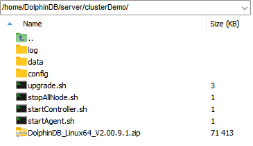

# 单节点部署

本教程用于单节点的部署、升级、过期 License 升级，并对常见问题做出解答，便于用户快速上手 DolphinDB。包含以下主题：

- [1. 在 Linux 操作系统部署 DolphinDB 单节点](#1-在-linux-操作系统部署-dolphindb-单节点)
  - [第一步：下载](#第一步下载)
  - [第二步：更新软件授权许可](#第二步更新软件授权许可)
  - [第三步：启动单节点](#第三步启动单节点)
  - [第四步：Web 管理界面检查节点运行状态](#第四步web-管理界面检查节点运行状态)
- [2. 在 Windows 操作系统部署 DolphinDB 单节点](#2-在-windows-操作系统部署-dolphindb-单节点)
  - [第一步：下载](#第一步下载-1)
  - [第二步：更新软件授权许可](#第二步更新软件授权许可-1)
  - [第三步：启动单节点](#第三步启动单节点-1)
  - [第四步：Web 管理界面检查节点运行状态](#第四步web-管理界面检查节点运行状态-1)
- [3. 单节点升级](#3-单节点升级)
  - [3.1 Linux 单节点升级](#31-linux-单节点升级)
  - [3.2 Windows 单节点升级](#32-windows-单节点升级)
- [4. 授权许可文件过期更新](#4-授权许可文件过期更新)
  - [第一步：替换授权许可文件](#第一步替换授权许可文件)
  - [第二步：更新授权许可文件](#第二步更新授权许可文件)
- [5. 常见问题解答（FAQ）](#5-常见问题解答faq)
  - [5.1 端口被其它程序占用导致启动失败怎么办？](#51-端口被其它程序占用导致启动失败怎么办)
  - [5.2 Web 管理界面无法访问怎么办？](#52-web-管理界面无法访问怎么办)
  - [5.3 Linux 升级失败如何版本回退？](#53-linux-升级失败如何版本回退)
  - [5.4 Windows 升级失败如何版本回退？](#54-windows-升级失败如何版本回退)
  - [5.5 在线更新授权文件失败怎么办？](#55-在线更新授权文件失败怎么办)
  - [5.6 如何进行配置参数调优？](#56-如何进行配置参数调优)
- [6. 参考](#6-参考)

## 1. 在 Linux 操作系统部署 DolphinDB 单节点

### 第一步：下载

- 官方下载地址：http://www.dolphindb.cn/downloads.html
- 通过 Shell 指令下载，以下载 2.00.9.1 版本为例：

```sh
wget "https://www.dolphindb.cn/downloads/DolphinDB_Linux64_V2.00.9.1.zip"
```

执行以下 Shell 指令解压安装包到指定目录，以解压 2.00.9.1 版本安装包到 */DolphinDB* 目录为例：

```sh
unzip DolphinDB_Linux64_V2.00.9.1.zip -d /DolphinDB
```

> ❗️ 安装路径的目录名中不能含有空格字符或中文字符，否则启动数据节点时会失败。

### 第二步：更新软件授权许可

如果用户拿到企业版试用授权许可，只需用其替换如下文件即可。

```sh
/DolphinDB/server/dolphindb.lic
```

如果用户没有申请企业版试用授权许可，可以直接使用程序包中的社区版试用授权许可。社区试用版指定 DolphinDB 单节点最大可用内存为 8GB，有效期为20年。

### 第三步：启动单节点

进入 */DolphinDB/server* 目录，第一次启动时需要修改文件权限，执行以下 Shell 指令：

```sh
chmod +x dolphindb
```

- 前台运行

执行以下 Shell 指令：

```sh
./dolphindb
```

系统默认端口号是8848。如果需要指定其它端口（例如8900）可以执行以下 Shell 指令：

```sh
./dolphindb -localSite localhost:8900:local8900
```

- 后台运行

执行以下 Shell 指令：

```sh
sh startSingle.sh
```

可以执行以下 Shell 指令以验证节点是否成功启动：

```sh
ps aux|grep dolphindb
```

返回如下信息说明后台启动成功：


### 第四步：Web 管理界面检查节点运行状态

在浏览器中输入部署服务器 IP 地址和部署端口号（默认是 8848）即可进入 Web 管理界面，
教程中的部署服务器 IP 地址为 10.0.0.82，部署端口为 8848，所以访问地址为 10.0.0.82:8848，
打开后的 Web 管理界面如下：


> ❗️ 如果浏览器与 DolphinDB 不是部署在同一台服务器，应事先关闭防火墙或者打开对应的部署端口，Web 管理界面才能正常打开。

## 2. 在 Windows 操作系统部署 DolphinDB 单节点

### 第一步：下载

官方下载地址：http://www.dolphindb.cn/downloads.html

解压安装包，例如解压到如下目录：

```sh
C:\DolphinDB
```

> ❗️ 安装路径的目录名中不能含有空格字符或中文字符，否则启动数据节点时会失败。例如不要装到 Windows 系统的 *Program Files* 目录下。

### 第二步：更新软件授权许可

如果用户拿到企业版试用授权许可，只需用其替换如下文件即可：

```sh
C:\DolphinDB\server\dolphindb.lic
```

如果用户没有申请企业版试用授权许可，可以直接使用程序包中的社区版试用授权许可。社区试用版指定 DolphinDB 单节点最大可用内存为 8GB，有效期为20 。

### 第三步：启动单节点

进入 *C:\DolphinDB\server* 目录，可以看到如下内容：


- 前台运行

双击运行 *dolphindb.exe*，出现如下界面：


系统默认端口号是 8848，可以通过修改配置文件 *dolphindb.cfg* 中的 **localSite** 参数指定其它端口。

- 后台运行

双击运行 *backgroundSingle.vbs*，然后打开 Windows 任务管理就可以查看到 DolphinDB 后台进程：


也可以打开命令提示符，执行以下指令查看 DolphinDB 后台进程，确认是否启动成功：

```sh
tasklist|findstr "dolphindb"
```


### 第四步：Web 管理界面检查节点运行状态

在浏览器中输入部署服务器 IP 地址和部署端口号（默认是 8848）即可进入 Web 管理界面，
教程中的部署服务器 IP 地址为 10.0.0.82，部署端口为 8848，所以访问地址为 10.0.0.82:8848，
打开后的 Web 管理界面如下：


> ❗️ 如果浏览器与 DolphinDB 不是部署在同一台服务器，需要关闭防火墙或者打开对应的部署端口，web 管理界面才能正常打开。

## 3. 单节点升级

### 3.1 Linux 单节点升级

**第一步：正常关闭单节点**

进入 */DolphinDB/server/clusterDemo* 目录执行以下 Shell 指令：

```sh
./stopAllNode.sh
```

**第二步：备份旧版本的元数据文件**

单节点元数据的默认存储目录：

```sh
/DolphinDB/server/local8848/dfsMeta/
```

```sh
/DolphinDB/server/local8848/storage/CHUNK_METADATA/
```

可在 */DolphinDB/server* 目录执行以下 Shell 指令备份单节点元数据：

```sh
mkdir backup
cp -r local8848/dfsMeta/ backup/dfsMeta
cp -r local8848/storage/CHUNK_METADATA/ backup/CHUNK_METADATA
```

> ❗️ 元数据文件可能通过配置文件指定存储在其它目录，如果在默认路径没有找到上述文件，可以通过查询配置文件中的 *dfsMetaDir* 参数和 *chunkMetaDir* 参数确认元数据文件的存储目录。若配置中未指定 *dfsMetaDir* 参数和 *chunkMetaDir* 参数，但是配置了 *volumes* 参数，则 *CHUNK_METADATA* 目录在相应的 *volumes* 参数指定的目录下。

**第三步：升级**  
> 注意：
>
> 当 server 升级到某个版本后，使用的插件也应升级到与此对应的版本。

- 在线升级

进入 */DolphinDB/server/clusterDemo* 目录执行以下 Shell 指令：

```sh
./upgrade.sh
```

运行后将会出现如下提示：


输入 y 并点击回车后会出现如下提示：


输入 1 选择在线更新，并点击回车后会出现如下提示：


输入所需更新的版本号再点击回车即可，以更新至 2.00.9.1 版本为例，输入 2.00.9.1 后点击回车，出现如下界面则表示升级成功：


- 离线升级

下载升级所需版本的安装包，官方下载地址：http://www.dolphindb.cn/downloads.html

将下载好的安装包上传至 */DolphinDB/server/clusterDemo* 目录下，以更新至 2.00.9.1 版本为例：



进入 */DolphinDB/server/clusterDemo* 目录执行以下 Shell 指令：

```sh
./upgrade.sh
```

运行后将会出现如下提示：


输入 y 并点击回车后会出现如下提示：


输入 2 选择离线更新，并点击回车后会出现如下提示：


输入所需更新的版本号再点击回车即可，以更新至 2.00.9.1 版本为例，输入 2.00.9.1 后点击回车，出现如下界面则表示升级成功：


**第四步：重新启动单节点**

进入 */DolphinDB/server* 目录执行以下 Shell 指令，后台运行 DolphinDB：

```sh
sh startSingle.sh
```

成功启动后，打开 Web 管理界面，在交互编程界面执行以下代码，查看 DolphinDB 当前版本：

```sh
version()
```

### 3.2 Windows 单节点升级

**第一步：正常关闭单节点**

- 如果是前台运行，关闭前台程序窗口
- 如果是后台运行，打开 Windows 任务管理器，找到 DolphinDB 的后台进程并关闭

**第二步：备份旧版本的元数据文件**

单节点元数据的默认存储目录：

```sh
C:\DolphinDB\server\local8848\dfsMeta\
```

```sh
C:\DolphinDB\DolphinDB\server\local8848\storage\CHUNK_METADATA\
```

进入 *C:\DolphinDB* 目录，在该目录下创建文件夹 *backup*，
然后把 *C:\DolphinDB\server\local8848* 文件夹下的 *dfsMeta* 文件及 *C:\DolphinDB\server\local8848\storage* 文件夹下的 *CHUNK_METADATA* 文件复制到上面创建的 *backup* 文件夹下，
如下图所示：


> ❗️ 元数据文件可能通过配置文件指定存储在其它目录，如果在默认路径没有找到上述文件，可以通过查询配置文件中的 *dfsMetaDir* 参数和 *chunkMetaDir* 参数确认元数据文件的存储目录。若配置中未指定 *dfsMetaDir* 参数和 *chunkMetaDir* 参数，但是配置了 *volumes* 参数，*CHUNK_METADATA* 目录在相应的 *volumes* 参数指定的目录下。

**第三步：升级**

- 下载所需升级版本的安装包，官方下载地址：http://www.dolphindb.cn/downloads.html
- 将新版本 *server* 目录下除 *dolphindb.cfg* 以及 *dolphindb.lic* 外的所有文件覆盖替换旧版文件

**第四步：重新启动单节点**

双击运行 *dolphindb.exe* 后在前台运行 DolphinDB。

成功启动后，打开 Web 管理界面，在交互编程界面执行以下代码，查看 DolphinDB 当前版本：

```sh
version()
```

## 4. 授权许可文件过期更新

### 第一步：替换授权许可文件

用新的授权许可文件 *dolphindb.lic* 替换旧的授权许可文件。

Linux 环境授权许可文件位置：

```sh
/DolphinDB/server/dolphindb.lic
```

Windows 环境授权许可文件位置：

```sh
C:\DolphinDB\server\dolphindb.lic
```

### 第二步：更新授权许可文件

- 在线更新

打开 Web 管理界面，在交互编程界面执行以下代码完成更新：

```sh
updateLicense()
```

> 注意，在线更新有如下要求：
>
> * License 授权的客户名称必须与原来的 License 相同。
> * 授权的节点个数，内存大小，CPU 核数不能比原来的小。
> * 更新只在执行该函数的节点生效。因此在集群环境下，需要在所有控制节点、代理节点、计算节点和数据节点上运行该函数。
> * License 的类型必须是 commercial（付费）类型和 free 类型。

- 离线更新

关闭 DolphinDB 后，重新启动，即可完成更新。

## 5. 常见问题解答（FAQ）

### 5.1 端口被其它程序占用导致启动失败怎么办？

DolphinDB 单节点默认启动端口是 8848，如果遇到无法启动 DolphinDB 的情况，
建议打开 */DolphinDB/server* 目录下的 *dolphindb.log* 日志文件，若出现如下错误：

```sh
<ERROR> :Failed to bind the socket on port 8848 with error code 98
```

说明选用的端口被其他程序占用，导致 DolphinDB 无法正常启动，修改配置文件中的端口为其它空闲端口后即可正常启动。

### 5.2 Web 管理界面无法访问怎么办？

DolphinDB 正常启动后，在浏览器输入正确的访问地址，但 Web 管理界面无法正常打开，如下图所示：


出现上述问题的原因通常是由于浏览器与 DolphinDB 不是部署在同一台服务器，
且部署 DolphinDB 的服务器开启了防火墙。可以通过关闭部署了 DolphinDB 的服务器的防火墙或者打开对应的部署端口，解决这个问题。

### 5.3 Linux 升级失败如何版本回退？

如果升级以后，不能正常开启单节点 DolphinDB ，可按以下方式回退到旧版本。

**第一步：恢复旧版本元数据文件**

在 */DolphinDB/server* 目录执行以下 Shell 指令恢复已备份的单节点元数据：

```sh
cp -r backup/dfsMeta/ local8848/dfsMeta
cp -r backup/CHUNK_METADATA/ local8848/storage/CHUNK_METADATA
```

**第二步：恢复旧版本程序文件**

在官方下载旧版本程序包，把重新下载的旧版本 *server* 目录下除 *dolphindb.cfg* 以及 *dolphindb.lic* 外的所有文件覆盖替换升级失败的文件。

### 5.4 Windows 升级失败如何版本回退？

如果升级以后，不能正常开启单节点 DolphinDB ，可按以下方式回退到旧版本。

**第一步：恢复旧版本元数据文件**

- 用升级前备份在 *backup* 目录下的 *dfsMeta* 文件复制替换 *local8848* 目录下的 *dfsMeta* 文件。
- 用升级前备份在 *backup* 目录下的 *CHUNK_METADATA* 文件复制替换 *local8848/storage* 目录下的 *CHUNK_METADATA* 文件。

**第二步：恢复旧版本程序文件**

在官方下载旧版本程序包，将重新下载的旧版本 *server* 目录下除 *dolphindb.cfg* 以及 *dolphindb.lic* 外的所有文件覆盖替换升级失败的文件。

### 5.5 在线更新授权文件失败怎么办？

在线更新授权文件需要满足[更新授权许可文件](#第二步更新授权许可文件)中在线更新的要求。如果不满足其中的要求，可以通过离线方式进行更新，或申请[企业版 License](https://www.dolphindb.cn/mx_form/mx_form.php?id=97)。

### 5.6 如何进行配置参数调优？

可以参考 DolphinDB 官方参数配置说明进行配置参数调优：[参数配置](https://www.dolphindb.cn/cn/help/200/DatabaseandDistributedComputing/Configuration/index.html)。

如果遇到性能问题，请添加微信号13362150840（仅用于添加微信）或扫描下面二维码，客服会邀您进群，由DolphinDB的技术支持工程师会解答您的问题。


## 6. 参考

更多详细信息，请参阅 DolphinDB 用户手册：

- [中文版 DolphinDB 用户手册](https://www.dolphindb.cn/cn/help/index.html)
- [英文版 DolphinDB 用户手册](https://www.dolphindb.com/help/index.html)
