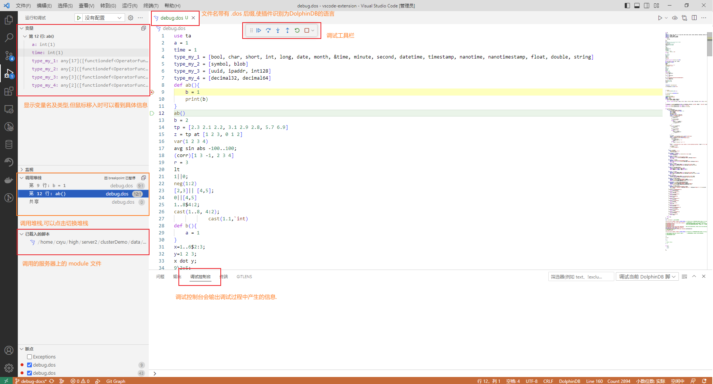

# DolphinDB VSCode 插件

VSCode 是微软开发的一款轻量、高性能又有极强扩展性的代码编辑器。它提供了强大的插件框架，开发者可以通过编写插件拓展 VSCode 编辑器的功能，甚至支持新的编程语言。

DolphinDB 公司开发了这个针对 DolphinDB 数据库的 VSCode 插件，在 VSCode 中增加了对自研的 DolphinDB 脚本语言的支持，让用户可以编写并执行脚本来操作数据库，或查看数据库中的数据。

- [DolphinDB VSCode 插件](#dolphindb-vscode-插件)
  - [功能](#功能)
  - [使用方法](#使用方法)
    - [安装](#安装)
    - [查看、编辑服务器连接配置](#查看编辑服务器连接配置)
    - [打开或新建一个 DolphinDB 脚本文件](#打开或新建一个-dolphindb-脚本文件)
    - [执行代码](#执行代码)
    - [在 DOLPHINDB 区域中切换连接及查看已连接会话的变量](#在-dolphindb-区域中切换连接及查看已连接会话的变量)
    - [查看函数文档](#查看函数文档)
  - [调试脚本](#调试脚本)
    - [原理](#原理)
    - [基本用法](#基本用法)
    - [进阶用法](#进阶用法)
    - [局限性](#局限性)
  - [常见问题](#常见问题)
  - [开发说明](#开发说明)


## 功能

- 代码高亮
- 关键字、常量、内置函数的代码补全
- 内置函数的文档提示、参数提示
- 终端可以展示代码执行结果以及 print 函数输出的消息
- 在底栏中展示执行状态，点击后可取消作业
- 在底部面板中以表格的形式展示表格、向量、矩阵等数据结构
- 在侧边面板中管理多个数据库连接，展示会话变量
- 在浏览器弹窗中显示表格


## 使用方法

### 安装

1. 前往[下载页面](https://code.visualstudio.com)安装或升级 VSCode 到最新版 (v1.68.0 以上)
2. 在 VSCode 插件面板中搜索 dolphindb, 点击 Install安装插件。如因网络原因安装遇阻，可以前往[下载链接](https://marketplace.visualstudio.com/items?itemName=dolphindb.dolphindb-vscode)手动下载后缀为 `.vsix` 的插件，下载后拖到 VSCode 插件面板中。
3. 点击 Version History 下载最新的版本到本地。安装插件后，退出 VSCode 所有窗口并重新打开 VSCode，否则可能无法在浏览器中查看变量 (见后文)。

### 查看、编辑服务器连接配置

1. 成功安装插件后，在VSCode编辑器左侧的资源管理器 (EXPLORER) 面板中新增的 DOLPHINDB 连接管理区域查看连接情况。

    

1. 点击右上角的 `settings` 按钮。
1. 在`settings.json` 配置文件中编辑 `dolphindb.connections` 配置项。
    - `name` 和 `url` 属性是必填的 (不同的连接对象必须有不同的 `name`), 默认自动登录 admin 账号 ("autologin": true)。将光标移动到属性上可以查看对应属性的说明。
    - `dolphindb.connections` 配置项是一个对象数组，默认有四个连接配置，可按情况修改或增加连接对象。

### 打开或新建一个 DolphinDB 脚本文件

**注意**：

- 如果脚本文件名是 `.dos` 后缀 (DolphinDB Script 的缩写)，插件会自动识别为 DolphinDB 语言，自动启用语法高亮及代码补全、提示
- 如果脚本文件名不是 `.dos` 后缀, 比如 `.txt` 后缀，则需要手动关联 DolphinDB 语言，方法如下：

1. 点击 VSCode 编辑器右下角状态栏的语言选择按钮，如下图
``
1. 在语言选择弹框中输入 `dolphindb`, 按回车键将当前文件关联的语言切换为 DolphinDB 语言。
``

### 执行代码

在打开的 DolphinDB 脚本文件中，按快捷键 `Ctrl + E` 将代码发送到 DolphinDB Server 执行。第一次执行代码时会自动连接到 DOLPHINDB 区域中选中的连接。

- 如果当前有选中的代码，会将选中的代码发送至 DolphinDB Server 执行
- 如果当前无选中的代码，会将当前光标所在的行发送至 DolphinDB Server 执行

执行代码后，VSCode 编辑器下方的终端内会有基于文本的输出，如果执行的代码最后一条语句返回了表格、数组、矩阵，则会自动切换到 VSCode 编辑器下方面板的 DolphinDB 区域中以表格的形式展示表格、向量、矩阵等数据结构。

**建议**：将 DolphinDB 标签页的内容拖动到终端的右侧，如下图


### 在 DOLPHINDB 区域中切换连接及查看已连接会话的变量

执行代码后，可以进行一下操作：

- 切换执行代码所用的连接 (原有连接不会断开)
- 点击连接右侧的按钮手动断开连接
- 查看会话变量的值
- 非 scalar, pair 类型的变量右侧有两个图标
  - 点击左边的图标可以在编辑器下方面板的 DolphinDB 区域中查看变量
  - 点击右边的图标可以直接打开一个浏览器弹窗，在弹窗中查看变量 (需要配置浏览器允许弹窗, 见后文)。弹窗功能需要浏览器中有一个打开的 `DolphinDB Data Browser` 标签页 (URL 可能是 http://localhost:8321/)，如果缺少这个标签页插件会先自动打开这个页面

如下图所示：


**注意**： 请使用近两年的浏览器版本，例如 Chrome 100+ 或 Edge 100+ 或 Firefox 100+，并配置浏览器允许该网站弹窗显示。


### 查看函数文档

在 VSCode 编辑器中输入 DolphinDB 内置函数时，点击函数右侧的箭头可以展开函数的文档：


函数输入完成后，将鼠标悬浮于函数名称上，也可查看函数文档。

## 调试脚本

DolphinDB 的 VSCode 插件提供针对用户脚本的调试功能，该功能满足实时追踪运行脚本、显示中间变量的值以及展示函数调用栈信息的用户需求，以利于用户写出更快更好的脚本。具体调试方法如下：

### 原理


其中，

- DolphinDB Server：真正执行中断、挂起、数据查询操作的数据库进程
- Debug Adapter：处理两侧的交互信息
- DAP：Debug Adapter Protocol，由 Microsoft 提出的一种通用的 Debug 信息交互协议
- Debug Client：VSCode 调试界面，主要负责与用户交互。下图是该界面的主要部件及功能概览：

    

### 基本用法

请运行不低于 2.00.10 或 1.30.22 版本的 DolphinDB Server，并按照下面的步骤进行调试

#### 编写脚本

后续步骤介绍基于以下例子脚本。出于调试目的以及代码可读性，我们建议每行只写一条语句。
  
```dos
  use ta

  close = 1..20
  bret = bBands(close)
  print(bret)

  close = randNormal(50, 1, 20)
  rret = rsi(close)
  print(rret)
 ```

#### 设置断点
  
1. 在选定行左侧空白处单击鼠标左键设置断点。

    

1. 为了接下来的调试演示，我们在第 4 行和第 8 行分别设置了断点，设置断点后，编辑器区的左侧空白区域处会出现红色的圆点，表示断点设置成功。

    
  
#### 启动调试
  
1. 在左下角的连接管理面板中选择用于调试的服务器。

    
  
2. 在底部状态栏中设置语言模式为DolphinDB。

    

3. 按 F5 或通过左侧边栏的运行和调试打开主边栏，点击 `运行和调试`。
  
    

启动后的界面如下图所示，


其中，

- 调试界面的左侧是调试信息区，右侧是编辑器区，下方是调试控制台。
- 调试信息区展示变量的值、函数调用栈等信息。
- 编辑器区用黄色的背景标出了将要执行的行。
- 调试控制台用于显示输出信息和异常信息。

**注意**：调试过程如果无法启动，打开调试控制台，通过错误信息检查排查错误原因。可能的错误原因包括：

- DolphinDB Server 版本太低会报错 `Server sent no subprotocol` 
- 调试服务器连接失败，请确保 DolphinDB Server 版本不低于 2.00.10 或 1.30.22。

#### 调试

启动调试后，VSCode 的界面上方会出现如下图所示的调试工具栏：


从左到右的名称及对应的键盘快捷键分别为：

- 继续（F5）
- 逐过程（F10）
- 单步调试（F11）
- 单步跳出（Shift + F11）
- 重启（Ctrl + Shift + F5）
- 停止（Shift + F5）

**建议**：继续、逐过程和单步调试是调试中最常用的三个功能，推荐使用快捷键来操作。

用于调试的按钮功能和使用方法如下：

- 逐过程（F10）：在上个调试界面中，黄色的背景标出了即将被 Server 执行的第 4 行代码所对应的语句。我们按下 F10，让 Server 程序执行完第 4 行代码。此时的调试界面如下图所示，黄色的背景变成了第 5 行代码所对应的语句。
    
    
- 继续（F5）：我们可以利用逐过程的方式一条语句一条语句地执行脚本，但是这样做的效率较低。着重关注断点所在的语句有助于提升执行调试效率。在这里，我们关心的是第 8 行代码所对应的语句，按下 F5 后，Server 程序会一直执行到第 8 行代码。此时的调试界面如下图所示，黄色的背景变成了第 8 行代码所对应的语句。
  
    

- 查看变量：在调试界面的左侧，即调试主边栏中，我们可以在略上方的位置看到变量的值，如下图所示：

    

    在这里，`close` 和 `bret` 这两个变量因为过长而导致显示不全，我们可以将光标悬浮在变量的值上方，即可看到完整的值。

    

- 单步调试（F11）：单步调试用于进入函数内部，查看函数内部的执行情况。在上一步，我们运行到了第8行代码，即 `rsi` 函数的调用语句。按下 F11 后，Server程序会进入 `rsi` 内。此时对应的调试界面如下图所示，黄色的背景标示程序已经运行到该函数内部，且即将执行第一条语句。

    

- 查看调用栈：我们将目光再次移动到调试主边栏中。在略下方的位置，可以看到当前的函数调用栈，如下图所示。

    
    
    单击调用栈的某一行，就能在上游函数和下游函数之间切换。此时，调试主边栏上方的变量部分也会显示该层函数所对应的变量的值。

- 动态更新断点：在脚本执行的过程中，我们可以动态地更新断点。例如，我们可以在 152 行和 153 行的位置新增两个断点，如下图所示，编辑器区的左侧空白区域处会出现两个红色的圆点，表示断点已经新增成功。

    

    当然，我们也可以取消断点。例如，我们单击 152 行左侧空白处来删除 152 行对应的断点。如下图所示，编辑器区左侧空白区域处 152 行对应的红色圆点消失，表示 152 行处的断点已经取消成功。

    

- 跳出函数：实际过程中，我们经常需要执行完这个函数并返回上层函数。例如，我们点击调试工具栏中的单步跳出按钮，即可执行完当前函数体的所有内容并返回到上一层函数。此时，如下图所示，我们已经返回到`test.dos`中的第9行代码所对应的语句，代表执行完第8行对应的 `rsi` 函数。

    

- 重启以及停止：重启和停止按钮的功能与其名字相符。例如，我们点击调试工具栏中的重启按钮，即可重启调试；相应地，点击停止按钮，即可停止调试。


### 进阶用法

#### 语法解析

调试开始时, DolphinDB 会对代码进行初步检测, 如果代码有语法错误, 不会进入调试状态, 并且调试控制台会输出错误信息。


#### 断点管理

如下图所示，在调试主边栏的下方，可以看到所有断点的信息，包括断点的状态、断点的文件名和文件路径以及行号。值得注意的是右上方有两个按钮，禁用所有断点以及删除所有断点。
  
- 点击禁用所有断点可以暂时关闭所有断点，恢复正常程序的执行；再次点击此按钮或者手动添加新断点时，会自动开启所有断点。
- 点击删除所有断点可以删除所有断点，包括已经禁用的断点。


#### 多目标调试

使用多目标调试很简单：在启动一个调试会话的同时, 只需启动另一个调试会话，VSCode 将自动切换到多目标模式：

- 各个会话现在在“调用堆栈”视图中显示为顶级元素
    
    

- 调试工具栏显示当前活动的会话（所有其他会话在下拉菜单中可用）

    

- 调试操作（例如, 调试工具栏中的所有操作）在活动会话上执行可以使用调试工具栏中的下拉菜单或在“调用堆栈”视图中选择其他元素来更改活动会话

### 局限性

#### 语法

以下脚本语法存在使用上的局限性：

- functionview 会通过初步的语法检查, 但使用此类语法会导致 DolphinDB 宕机。
- 含有 include 语句的脚本调试会报错“Does not support Debug mode when using include”。可以考虑用 use 替代。
- submitJob, remoteRun 等远程调用类函数不能跟踪函数栈调用
- 匿名函数、lambda 表达式、闭包

#### 调试方法

暂不支持以下调试方法

- 内联断点、条件断点、记录点、监视
- 查看长度较大的变量

    

- 调试控制台查询表达式的值

## 常见问题

执行代码过程中，

- 如果出现 `Webview fatal error: Error: Could not register service workers: InvalidStateError: Failed to register a ServiceWorker: The document is in an invalid state..` 这样的错误，重启 VSCode。
- 如果出现执行代码并返回表格后，底部没有自动切换到 DolphinDB 视图的情况，需要重置 DolphinDB 视图的位置，如下图所示

    
    
- 如果按 `Ctrl + E` 快捷键无反应：
    - 可能是由于未关联 DolphinDB 语言（此时语法高亮也未生效）
    - 也可能由于快捷键与其他插件冲突，需要在 VSCode 的 `文件 > 首选项 > 键盘快捷方式` (`File > Preferences > Keyboard Shortcuts`) 中自定义快捷键，在搜索框中输入 `CTRL+E`, 删除和 `DolphinDB: 执行代码` 冲突的其他插件的快捷键。

    
    
- VSCode 有大约为 `1 GB` 的内存限制。建议使用 `limit` 限制返回记录数；或者将结果赋给某个变量，如 `a = select * from`，后续通过点击侧边栏变量旁边的按钮进行分页懒加载，按需取回单页数据。
- 为了在浏览器中展示表格等数据，每个 VSCode 窗口会启动一个本地 HTTP 服务器，其可用端口范围可以通过 `dolphindb.ports` 配置，默认为 `8321-8420`，鼠标悬浮在 ports 上可查看详细解释。

## 开发说明

```shell
# 安装最新版的 nodejs
# https://nodejs.org/en/download/current/

# 安装 pnpm 包管理器
corepack enable
corepack prepare pnpm@latest --activate

git clone https://github.com/dolphindb/vscode-extension.git

cd vscode-extension

# 安装项目依赖
pnpm install

# 将 .vscode/settings.template.json 复制为 .vscode/settings.json
cp .vscode/settings.template.json .vscode/settings.json

# 参考 package.json 中的 scripts

# 构建开发版本
pnpm run dev

# 在 VSCode 中切换到调试面板，启动 ddb.ext 调试任务（需要先禁用或卸载已安装的 dolphindb 插件）
```
